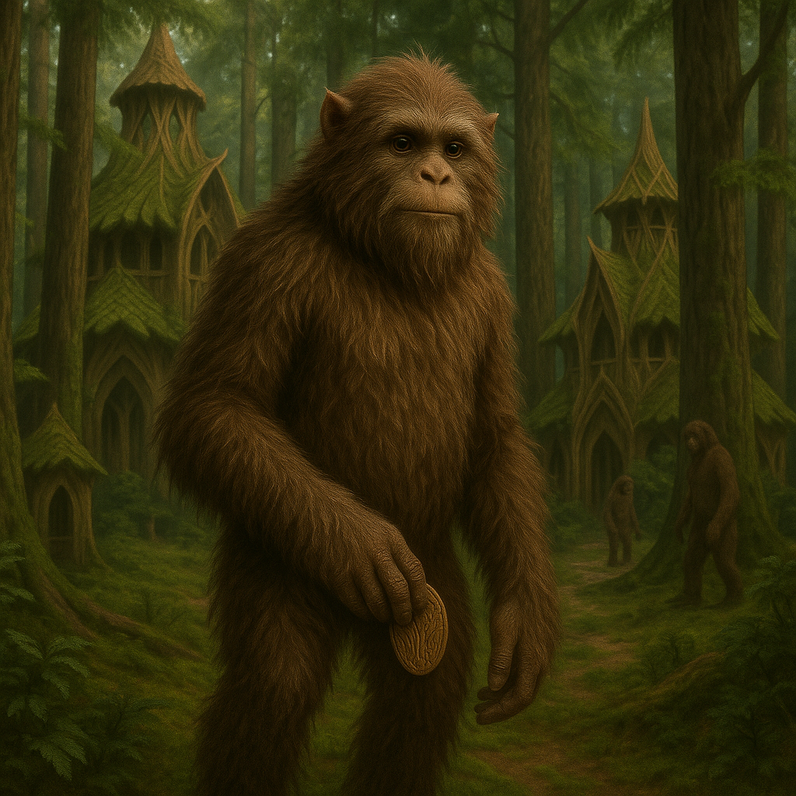

## Voshkane

### Description:

The Voshkane are furred, long-armed forest dwellers whose supple limbs let them swing, climb, and glide through dense canopy with uncanny silence. Their thick pelts range in color with the seasons, mottling to match bark and leaf, and their broad, padded hands grip branch and vine as easily as tools. Large, soft eyes and swiveling ears make them superb at sensing movement in the green gloom, and they tread so quietly that even the most skittish forest creatures scarcely mark their passing.

Voshkane society is built from **clans**, each bound to a stretch of ancient woodland and to one another by a web of obligation and kinship. The great expression of this bond is the **seasonal gathering**, when far-flung clans converge in forest clearings to feast, settle matters, and above all to exchange **carved tokens** — small, intricate works whittled from heartwood, each one a record of a debt owed, a promise made, or a friendship renewed. That whittling has grown into a wider knack for craft: beyond their tokens the Voshkane shape fine tools, looms, and worked goods with a care few forest peoples trouble to learn. A Voshkane's string of received tokens is their reputation made tangible, carried always and read like a history.

Quietness runs through everything the Voshkane do and value. They prize subtlety, patience, and the ability to move through the world without disturbing it, and they regard loud or heedless behavior as a mark of poor character. Their craft is delicate, their speech soft, and their diplomacy conducted in the slow, careful exchange of gifts rather than demands. To the Voshkane, the forest teaches the great lesson of their lives: that the one who moves gently and gives generously is the one the world comes to trust.

### Notable Traits:

- Habitat: Dense forests and jungle canopy
- Lifespan: 90–120 years
- Strength: Silent movement, agility, and skilled climbing and craftwork
- Weakness: Ill at ease in open ground and uncomfortable with confrontation
- Temperament: Quiet, generous, and reserved

### Fun Fact:

A Voshkane elder may carry hundreds of carved tokens, and can recount the story behind every single one from memory.

---

*"Move softly, give freely, and the forest will remember you kindly."* — Voshkane proverb

[Back to Aliens](../aliens.md#voshkane)
