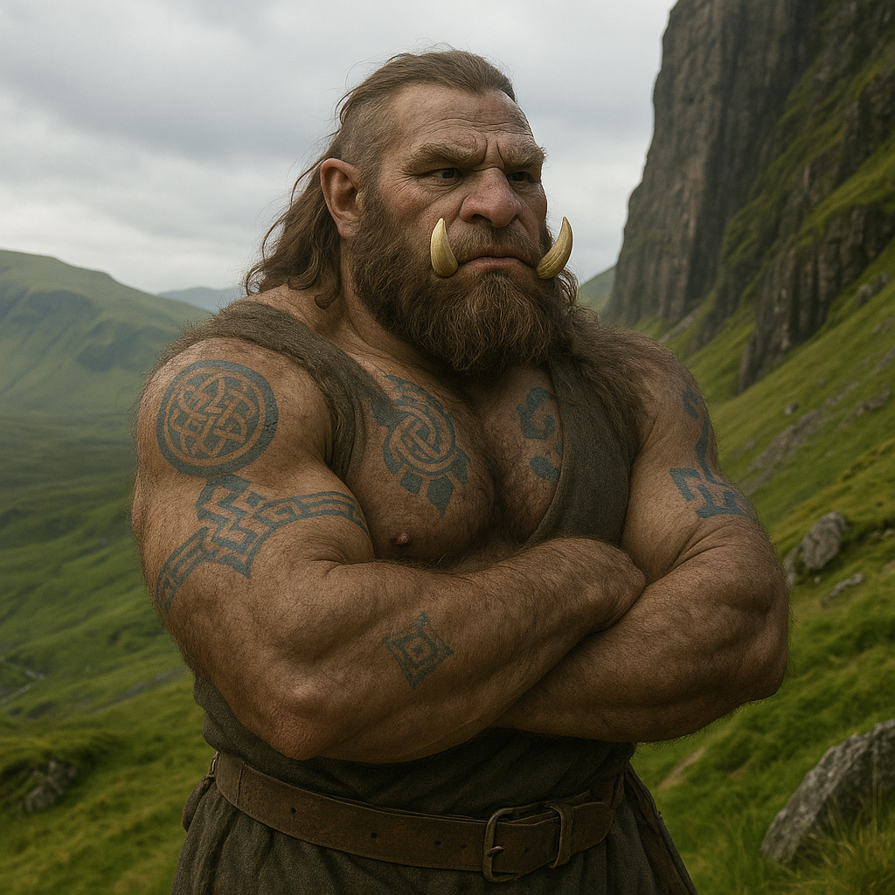

## Vraddek

### Description:

The Vraddek are a burly, tusked people, thick-limbed and heavy-shouldered, built like the granite crags they call home. Pale ivory tusks curve up from their lower jaws, their hides are tough and weathered, and their broad hands end in blunt, powerful fingers that find purchase on the smallest ledge. They are inhabitants of the rugged highlands — the knife-edged ridges, the vertical cliffs, the storm-lashed peaks that other peoples avoid — and generations of life among the heights have bred into them an easy, fearless mastery of sheer rock that borders on the supernatural. A Vraddek will scale a cliff face that would daunt a professional climber of another folk while carrying on an unhurried conversation, pausing only to admire the view.

The Vraddek are a people of their word in the most literal and permanent sense. When a Vraddek makes an important promise — a vow of marriage, a sworn alliance, a solemn debt, a blood-oath of friendship — it marks the pledge upon its own skin with an elaborate, permanent tattoo, inked in a slow and painful ceremony witnessed by the community. These oath-marks accumulate over a lifetime until an elder Vraddek's body is a dense, intricate chronicle of every binding commitment it has ever made, a walking contract that can be read by anyone who knows the symbols. To break a tattooed promise is the deepest disgrace a Vraddek can suffer, a stain that cannot be washed away because the broken word is literally carved into the flesh, and such oath-breakers are shunned, their marks publicly struck through in a ritual of lasting shame.

This fusion of physical hardihood and inked honor makes the Vraddek a formidable and famously trustworthy people. Their word, once given and marked, is as solid as the mountains they inhabit, and allies across the continent prize a Vraddek oath above any paper treaty, knowing it is backed by the whole weight of a culture that regards a broken promise as a mutilation of the self. They are gruff and plain-spoken, slow to make a vow precisely because they take vows so seriously, but immovable once committed. Their society is bound together not by distant laws but by this living web of personal, visible, permanent promises, a web they climb through life as surely and fearlessly as they climb their beloved cliffs — one solid handhold, one unbreakable word, at a time.

### Notable Traits:

- Habitat: Rugged highlands, sheer cliffs, and storm-swept mountain ridges
- Lifespan: 140–180 years
- Strength: Immensely strong; peerless climbers of sheer rock; utterly reliable
- Weakness: Gruff and stubborn; slow to commit and uneasy on open flatlands
- Temperament: Blunt, honorable, and immovably steadfast

### Fun Fact:

A Vraddek's body, read tattoo by tattoo, is a complete biography of every promise it ever made — which is why their eldest and most-inked members are consulted as living archives of the community's oaths.

---

*"A word spoken is wind; a word carved in the skin is stone — swear nothing you are not willing to wear forever."* — Vraddek oath-marker's warning

[Back to Aliens](../aliens.md#vraddek)
