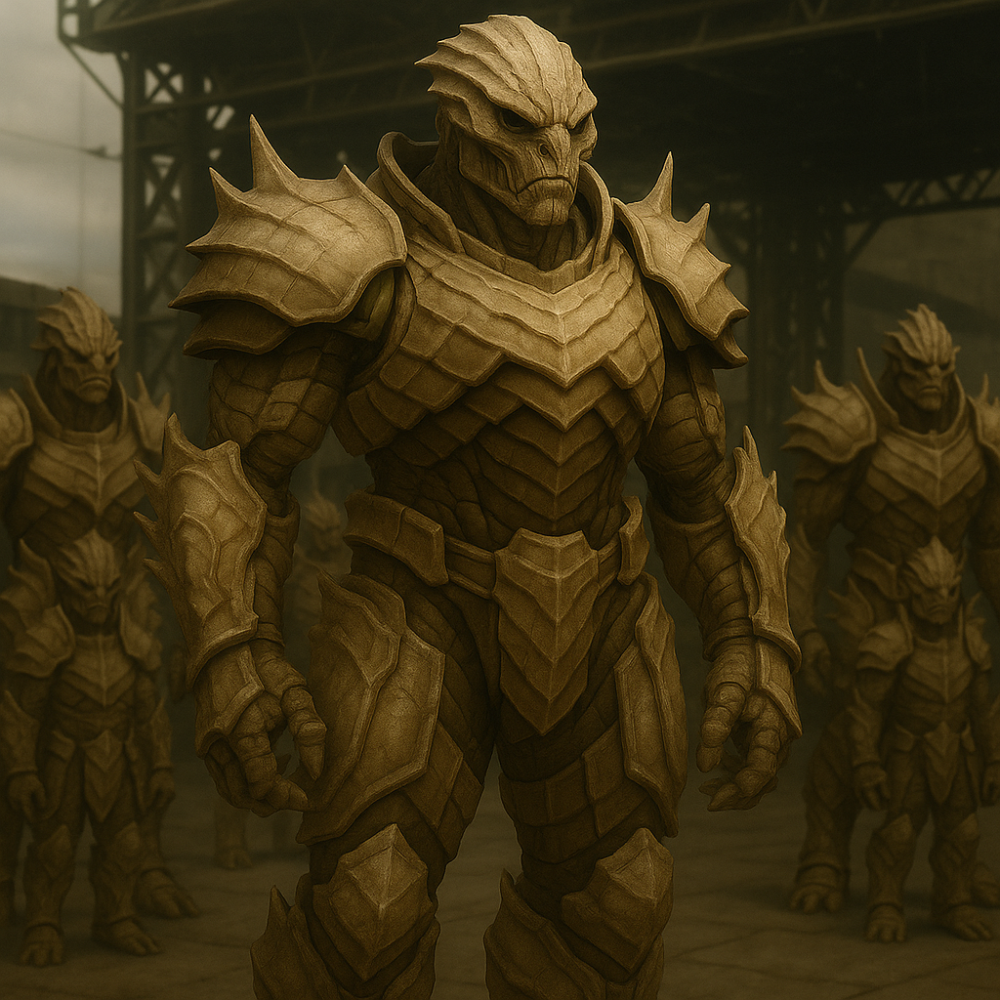

## Vraektor

### Description:

The Vraektor are towering giants, broad as doorways and crowned with ridges of layered bone armor that plate their shoulders, forearms, and brows like the overlapping scales of some ancient beast. Each plate is grown, not forged — a living armor that thickens with age, so that an elder Vraektor is a walking fortress and a scarred veteran wears their history in the chipped and mended ridges of their hide. For all their fearsome bulk, their deep-set eyes are gentle, and their voices, when they speak, rumble with a slow and careful gravity.

To the uninitiated, the Vraektor appear to be the galaxy's most natural conquerors — and that assumption has been the undoing of many. For the Vraektor honor code holds that strength exists for one purpose only: the protection of the vulnerable. A warrior who turns their power against the weak is not a warrior at all but a disgrace, stripped of their war-name and exiled. Their legends do not celebrate the burning of cities or the breaking of enemies; they celebrate the shield held over the fallen, the stand made at the narrow pass, the children carried to safety through the storm. Glory, to a Vraektor, is measured by who you saved, never by whom you slew.

This creed shapes a surprisingly tender society beneath its armored surface. Vraektor warriors apprentice themselves to the care of the frail, the elderly, and the orphaned; a young warrior earns their first armor-plate not in battle but by completing a season of guardianship over those who cannot protect themselves. Their great halls are as much hospices and shelters as they are barracks, and the most honored seat at any feast belongs not to the strongest fighter but to the one who has saved the most lives.

Governed by councils of shield-elders — veterans too scarred to fight who now guide the young — the Vraektor are slow to rouse but implacable once committed. They will not start a war, but woe to any aggressor who threatens those under Vraektor protection, for there is no force in the galaxy more immovable than a Vraektor standing between a bully and its intended prey.

### Notable Traits:

- Habitat: Rugged lowlands and fortified communal halls
- Lifespan: 150 years
- Strength: Immense physical power and natural bone armor
- Weakness: Bound by an honor code that forbids aggression and exploitation
- Temperament: Protective, honorable, and slow to anger

### Fun Fact:

A Vraektor earns each plate of ceremonial armor not by defeating a foe but by proving they have shielded someone weaker than themselves from harm.

---

*"The strong were given their strength so the weak would never stand alone."* — Vraektor proverb

[Back to Aliens](../aliens.md#vraektor)
