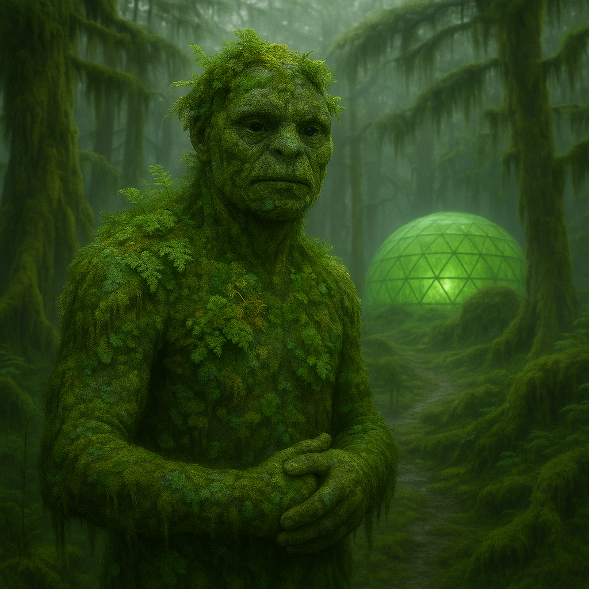

## Wexmoor

### Description:

The Wexmoor are a mottled, moss-coated people whose skin is less a surface than a soil. Across the broad backs and rounded shoulders of every adult grows a living carpet of lichen, creeping moss, and tiny flowering stalks, cultivated with the same care a gardener gives a prized bed. Born of damp, mist-drowned worlds where the sun arrives only as a pale smear behind the clouds, the Wexmoor long ago struck a bargain with the greenery that colonized their ancestors' hides: the plants are fed and sheltered, and in return they purify the air a Wexmoor breathes, soften its skin against the perpetual wet, and signal its health in color and bloom. A Wexmoor whose garden withers is a Wexmoor who is ailing, and the first thing a healer examines is not the patient's pulse but the vigor of the moss upon its neck.

Because their worlds are so often fog-blind, the Wexmoor learned to know one another not by face but by scent. Each individual carries a signature bouquet — a blend of the particular species that flourish on its body — and this living perfume is as distinct as a name. Greetings among them are an elaborate leaning-together, a mutual inhalation, and from a single breath a Wexmoor can tell a stranger's lineage, mood, diet, and whether it has recently grieved. To mask one's scent is the gravest of insults, an act of deliberate anonymity that borders on the criminal, and the only disguise their shame-faced lawbreakers ever bother to attempt.

Wexmoor society is slow, patient, and relentlessly cooperative, shaped by a people who think in growing seasons rather than hours. Their settlements are terraced gardens where the boundary between dwelling and plant life blurs entirely; walls sprout, roofs flower, and a visitor can scarcely tell where the architecture ends and the agriculture begins. More hands-on than their gentle manner suggests, the Wexmoor dam the slow waters, cut terraces and drainage channels, and weave living looms and trellises, patiently shaping their damp world rather than merely dwelling in it. They hold that nothing truly dies but only composts into the next living thing, and so they bury their dead shallowly beneath young saplings, trusting the deceased to rise again as leaf and petal. Leadership falls to the eldest "cultivators," those whose body-gardens have grown richest and most fragrant over long lives, for among the Wexmoor a well-kept garden is the visible proof of a well-kept soul.

### Notable Traits:

- Habitat: Damp lowlands, marshes, and fog-shrouded forests
- Lifespan: 120–160 years, mirroring the slow cycles of their gardens
- Strength: Superb cultivators and air-purifiers; near-perfect scent memory
- Weakness: Suffer badly in arid heat, which scorches their living coat
- Temperament: Patient, gentle, and deeply communal

### Fun Fact:

A Wexmoor courtship often begins with the gift of a rare moss cutting, and a couple is considered wed only once each has coaxed the other's seedling to bloom upon their own skin.

---

*"A face can lie, but no one has ever met a dishonest smell."* — Wexmoor cultivators' saying

[Back to Aliens](../aliens.md#wexmoor)
