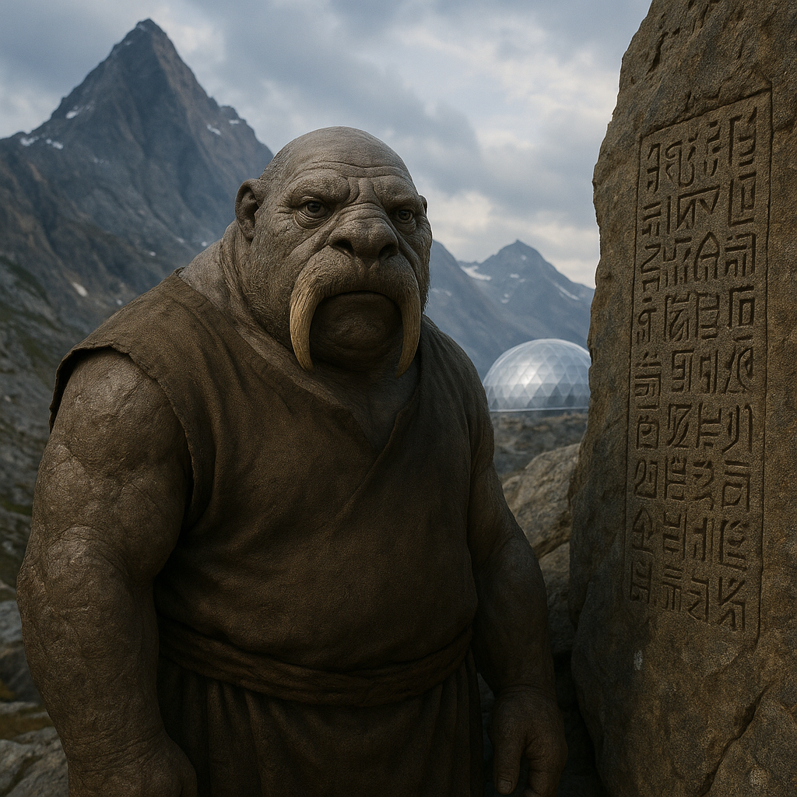

## Woltrim

### Description:

The Woltrim are a stocky, broad-shouldered people whose bodies seem carved from the very highlands they call home. Twin tusks curve upward from their lower jaws, worn and polished with age, and their barrel chests house a pair of enormous, deeply folded lungs. On the thin-aired plateaus and windswept ridges of their mountain world, where lesser species gasp and stumble, a Woltrim breathes easily, drawing on reserves of air the way others draw on memory. Their skin is a weathered gray-brown, roughened by altitude and sun, and their eyes are small, dark, and patient.

To the Woltrim, nothing matters more than permanence. Spoken words drift away on the mountain wind, but stone remembers. Every clan maintains a vast gallery of carved histories — spiraling reliefs chiseled into cliff faces and cavern walls, recording births, deaths, treaties, betrayals, and the slow turning of generations. Tireless quarriers and builders, they hew these galleries from the living rock and raise terraced stone halls, bridges, and ridge-top strongholds that few other peoples could ever construct. A Woltrim child learns to read these walls before learning to speak at length, tracing cold grooves with a fingertip while an elder narrates the deeds encoded there. To deface a history-wall is their gravest crime; to add a true and beautiful chapter to one is their highest honor.

Their powerful lungs shape far more than survival. Woltrim ceremonies are built on sustained song — single notes held for impossible lengths, deep droning harmonies that fill a canyon and set the stone humming. The ability to endure thin air for days without rest has made them tireless pilgrims, climbing to summits no other species can reach to carve shrines at the roof of the world. Their patience, their endurance, their reverence for what lasts — all of it flows from a people who learned that in a place where breath itself is scarce, the only wealth worth keeping is the kind that cannot blow away.

Woltrim society is organized around the stewardship of these histories: elder carvers hold enormous authority, not as rulers but as keepers of truth, and disputes are settled by appeal to what the walls record rather than by force. They are slow to anger and slower to forgive, but a Woltrim's given word, once carved, is kept absolutely.

### Notable Traits:

- Habitat: High mountain plateaus and thin-air highlands
- Lifespan: 130 years
- Strength: Extraordinary endurance and the ability to survive prolonged exertion in thin air; prolific stoneworkers, quarriers, and builders
- Weakness: Slow to adapt to lowland heat and dense, humid air
- Temperament: Patient, stoic, and fiercely devoted to tradition

### Fun Fact:

A Woltrim can hold a single sung note long enough to walk the length of a canyon, and competitive "breath-songs" are the centerpiece of their coming-of-age festivals.

---

*"The wind forgets, but the stone remembers — so carve carefully."* — Woltrim proverb

[Back to Aliens](../aliens.md#woltrim)
