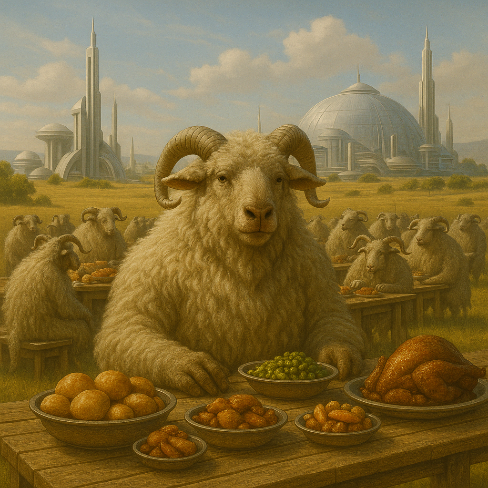

## Wulmarra

### Description:

The Wulmarra are woolly, horned grazers of the great open plains, broad-chested and heavy-shouldered beneath thick coats of russet and cream. A pair of spiraling horns sweeps back from each brow, polished by generations of ritual grooming, and their wide, flat-toothed jaws are built for the endless chewing of plains-grass. They walk upright on powerful cloven legs but drop to all fours to run, and when a herd moves together across the grasslands the ground trembles with their passage.

If any single word defines the Wulmarra it is generosity. Their calendar is a long chain of feasts, each marking a season, a harvest, a birth, or a reconciliation, and no Wulmarra feast is complete until every traveler within a day's walk has been fed to bursting. Wealth among them is measured not in what one hoards but in what one gives away, and a family's standing rises with every table it sets. To turn a guest from one's hearth is the deepest shame a Wulmarra can bear, remembered in song for generations.

The Wulmarra possess an uncanny sensitivity to the weather, feeling the pressure of a coming storm in their horns and the roots of their wool hours before the sky darkens. This gift makes them superb stewards of the open country, able to shelter their herds and lay in stores before the worst arrives. It also feeds their culture of abundance: knowing hardship is coming teaches the value of sharing while the sun shines, and the greatest feasts are often thrown on the eve of a great storm, defiant celebrations of plenty against the gathering dark.

Socially the Wulmarra gather into vast, loosely allied herds led by councils of grandmothers, the Horn-Mothers, whose authority rests on their skill at reading both weather and people. Decisions are made over shared meals, where the passing of food around a circle is itself a form of voting. Boisterous, warm, and quick to laughter, the Wulmarra nonetheless carry a current of melancholy, for they know as well as anyone that every feast ends and every storm comes — and they would rather meet it with full bellies and good company than with fear.

### Notable Traits:

- Habitat: Open plains and rolling grasslands
- Lifespan: Moderate — around 70 years
- Strength: Weather-sense that forewarns of storms; prodigious communal provisioning
- Weakness: Reluctant to abandon the open country; vulnerable in confined terrain
- Temperament: Generous, boisterous, and warm-hearted

### Fun Fact:

A Wulmarra can tell you how hard it will rain tomorrow by the way the wool on its shoulders stands.

---

*"Set an extra place; the storm may send us a friend."* — Wulmarra feast-blessing

[Back to Aliens](../aliens.md#wulmarra)
