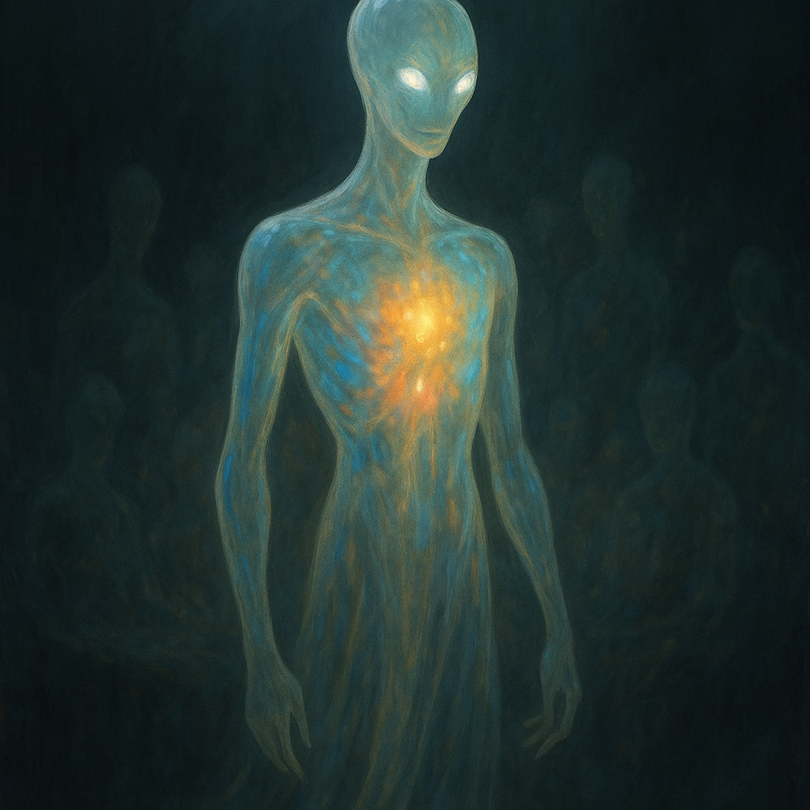

## Xel'Thara

### Description:

The Xel'Thara are a tall, translucent people whose bodies glow from within, their inner light rippling through soft hues that betray every passing emotion. A Xel'Thara in contentment burns a steady amber; one in grief dims to a deep oceanic blue; a crowd in agreement shimmers in unison like a field of slow lightning. Because their feelings are literally visible, deception is nearly impossible among them, and so their society has grown around a radical, almost unsettling honesty.

Their homeworld's long twilight shaped a people who revere memory above all else. The Xel'Thara believe that a life is not truly lived until it has been shared, and that the dead are not gone so long as their memories still circulate among the living. To this end they practice the communal dream-rituals for which they are known across the continent: gathering in darkened halls, dozens of Xel'Thara link hands and sink into a shared sleep, projecting fragments of ancestral memory into one another's minds. A grandmother's first sight of the twin moons, a warrior's final breath, a child's delight at a found stone — all of these pass hand to hand across generations, kept alive in the collective dreaming.

Their colonies are quiet, luminous things, built low and open so the light of their citizens can be seen from afar. They tend to settle near water, where their glow reflects and doubles, and they consider a lake at night that mirrors a gathered family to be among the most sacred of sights. Leadership among them falls not to the strongest or wealthiest, but to the finest "rememberers" — those who can hold and recount the most memories without distortion.

### Notable Traits:

- Habitat: Twilight shores and still waters
- Lifespan: 150–180 years, though memory outlives the body
- Strength: Flawless emotional honesty and a vast inherited memory
- Weakness: Cannot conceal intent; vulnerable to those who exploit their candor
- Temperament: Serene, contemplative, deeply communal

### Fun Fact:

A Xel'Thara who falls in love is said to be "unable to lie about it to the whole room" — their glow turns a telltale rose that no amount of composure can suppress.

---

*"A memory shared is a life twice lived; a memory hoarded is a life already lost."* — Xel'Thara dream-rite invocation

[Back to Aliens](../aliens.md)

[Back to Aliens](../aliens.md#xelthara)
