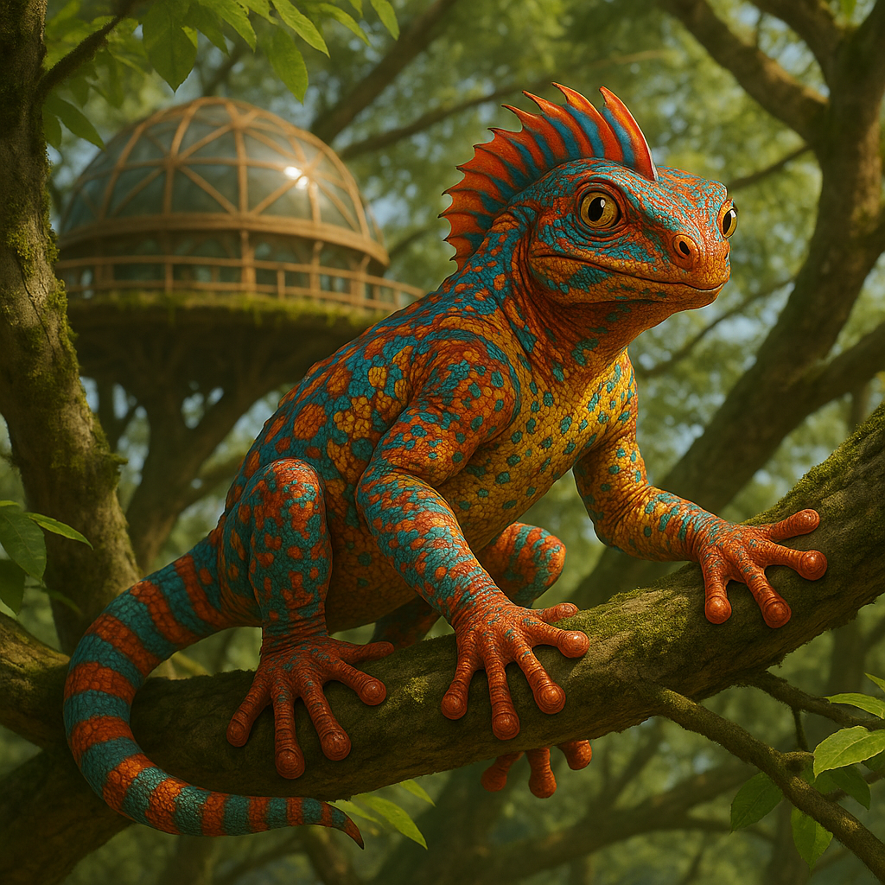

## Xibante

### Description:

The Xibante are brightly patterned, six-limbed climbers whose bodies blaze with vivid bands of color — electric blues, molten oranges, and deep jungle greens arranged in dazzling geometric designs unique to each individual. Four of their limbs serve as legs and the upper two as arms, though all six end in broad palms capable of gripping sheer bark or polished stone, for the Xibante secrete a mild natural adhesive from their palm-pads that lets them scale surfaces that would defeat any other species. They live among the great canopy-forests of their world, flashing from branch to branch in a riot of color, as much at home dangling upside-down as standing upright.

Gift-giving is the beating heart of Xibante culture. No meeting, however brief or casual, passes without an exchange of small presents — a woven trinket, a sweet fruit, a bead of hardened sap, a clever little carving. These gifts are not payment or bribery but the very grammar of their society, a way of saying "I see you, I value this moment." To meet a Xibante empty-handed is a faux pas; to refuse their gift is an insult; to give a thoughtful, well-chosen present is to speak their language fluently. Their homes overflow with the accumulated tokens of a lifetime of meetings, each one a tiny monument to a relationship.

Their palm-adhesive, so central to their arboreal lives, also makes them prolific crafters and builders: the finest Xibante presents are intricate assemblages glued together with a dab of their own secretion, and the same bonding art raises their canopy-towns — gluing timber, bark, and salvage into bridges, towers, and workshops no other species could assemble. A master gift-maker is a celebrated figure, and the art of choosing and crafting the perfect present for a given person and occasion is studied with the seriousness other cultures reserve for diplomacy or war — which, for the gift-obsessed Xibante, it essentially is.

Xibante communities are vibrant, chattering, intensely social affairs, their canopy-towns strung with bridges and festooned with the colorful debris of endless gift-exchange. Status flows not to the richest but to the most generous — the Xibante who gives the most thoughtfully and receives the most gratefully. Warm, exuberant, and irrepressibly friendly, they regard a stranger not as a threat but as an exciting new partner in the lifelong game of giving.

### Notable Traits:

- Habitat: Dense canopy-forests and arboreal towns
- Lifespan: 65 years
- Strength: Agile climbing and a natural palm-adhesive that makes them prolific crafters and builders
- Weakness: Ill at ease on open ground far from the shelter of the canopy
- Temperament: Exuberant, generous, and intensely social

### Fun Fact:

A Xibante judges a new acquaintance less by what they say than by the care taken over the first small gift they offer.

---

*"An empty hand is a closed door; a gift is the key that opens it."* — Xibante proverb

[Back to Aliens](../aliens.md#xibante)
