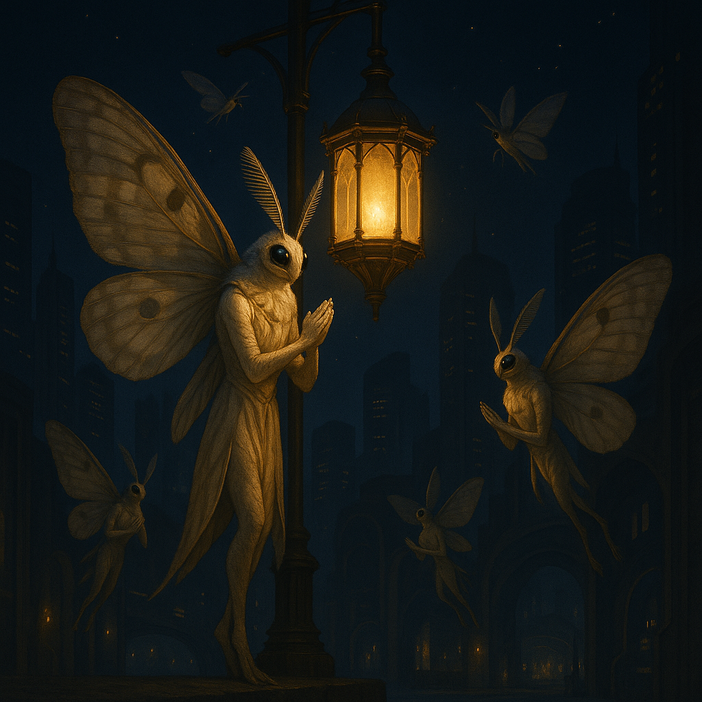

## Ybernith

### Description:

The Ybernith are delicate, mothlike beings whose broad, dust-scaled wings span nearly twice the height of their slender bodies. In daylight those wings appear a muted ash-gray, but under the right slant of light they fluoresce in bands of lilac and pale gold, so that a gathering of Ybernith at rest resembles a drift of living lanterns. Their faces are dominated by enormous feathered antennae and compound eyes that drink in the faintest glimmers; they move with a soft, hovering grace, rarely touching the ground for long.

Light is the center of Ybernith faith. Every colony is built around a radiant focus — a flame, a crystal lens, or in modern times a cultivated glow-garden — and the people gather there to pray, folding their wings into cathedral arches of translucent membrane. To the Ybernith, illumination is not merely useful but sacred: a visible echo of the hidden order of the cosmos. Their liturgical calendar tracks the angle and polarization of the sky, and their priests, called Lumenwrights, are as much astronomers as clergy.

What truly distinguishes the Ybernith is their gift for reading the polarized sky. Where other species see a flat blue dome, the Ybernith perceive sweeping patterns of light that reveal the sun's position even through cloud or dusk. This sense makes them unerring navigators, able to cross featureless expanses and return home by instinct alone. Their maps are not drawn in lines but sung in long tonal poems describing how the sky's glow shifts across a journey, and a young Ybernith is considered an adult only once it can recite the sky-song of its homeland without error.

Socially the Ybernith organize into luminous "congregations" rather than clans, bound by shared devotion to a particular radiant focus. Decisions are made collectively at dawn and dusk, the two moments when the polarized sky is richest, and dissent is expressed by dimming one's own bioluminescence rather than through argument. Gentle and contemplative, they find conflict distasteful and prefer to drift away from trouble on the wind, though a congregation deprived of its light will fight with startling desperation to reclaim it.

### Notable Traits:

- Habitat: Twilight forests and high open skies near luminous landmarks
- Lifespan: Short — roughly 25 years, lived at a feverish, luminous pace
- Strength: Flawless navigation by polarized light, even in poor visibility
- Weakness: Fragile wings easily damaged by storms and rough handling
- Temperament: Gentle, devout, and conflict-averse

### Fun Fact:

An Ybernith can plot a thousand-league migration from a single patch of sky glimpsed through a gap in the clouds.

---

*"Follow the light, and the light will show you the way home."* — Ybernith sky-song

[Back to Aliens](../aliens.md#ybernith)
