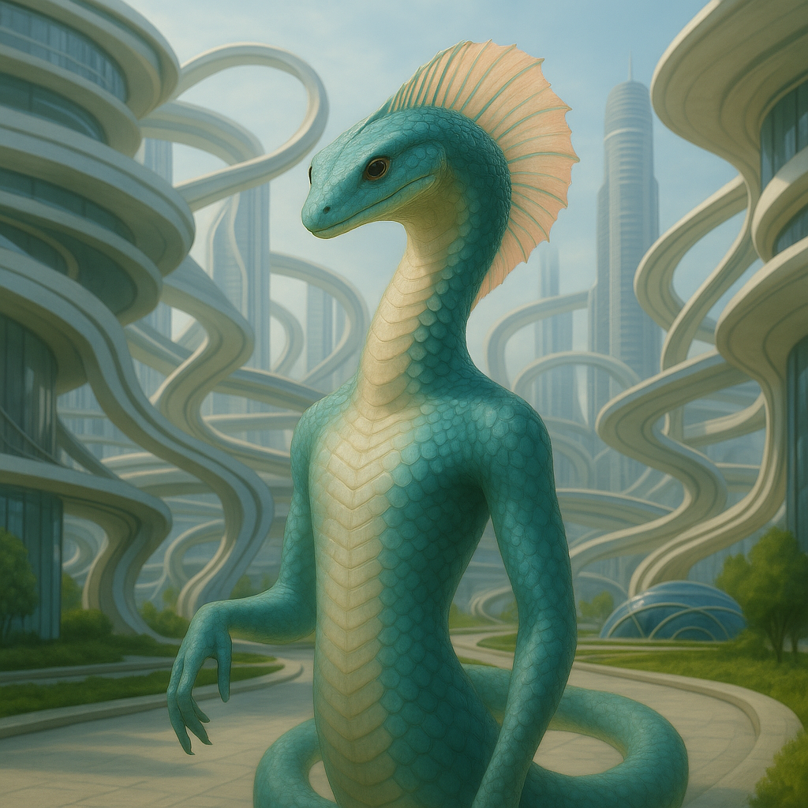

## Ylssuran

### Description:

The Ylssuran are a serpentine people, long and sinuous, flowing rather than walking across the ground on coils of smooth, supple muscle. Along their spines and crowning their narrow heads run delicate crest-fins — translucent, iridescent membranes that fan and furl with every mood, catching the light like wet silk and lending even the smallest gesture an element of quiet dance. There is nothing abrupt about an Ylssuran; they move in slow, deliberate curves, and they regard the jerky, sudden motions of limbed peoples as faintly comic and more than a little rude.

Formality is the soul of Ylssuran culture, and nowhere does it show more than in their greetings. When two Ylssuran meet, they perform a slow and intricate ritual of recognition — a graceful swaying of the body, a measured furling and unfurling of the crest-fins, a stately exchange of courtesies that may stretch on for many minutes before any ordinary business is broached. To rush a greeting is, among them, a grave insult, a declaration that the other is not worth the time; and the length and elaboration of a greeting is a precise measure of the respect intended, so that a casual passerby earns a brief sway while an honored elder commands a full ceremonial display. Their whole etiquette is built upon this foundation of unhurried mutual acknowledgment, and an Ylssuran judges a stranger's quality almost entirely by the patience and grace of its first few moments.

This refinement is underwritten by an exquisite physical sensitivity: the Ylssuran feel the faintest vibrations through the length of their bodies, reading the ground and the air the way others read a face. A footstep three rooms away, the tremor of an approaching storm, the nervous tremble in a liar's voice, the subtle quaver of grief beneath a composed exterior — all of these the Ylssuran sense directly, feeling the truth of a situation in their very flesh. This gift makes their slow greetings far more than mere ceremony, for in those still, swaying minutes an Ylssuran is in fact listening with its whole body to the vibrations of the one before it, taking the measure of its honesty, its health, and its hidden intent. A people who can feel a lie tremble through the floor have little use for haste or bluster, and they have built a serene, perceptive, and deeply courteous civilization upon the quiet certainty that the truth always, eventually, makes itself felt.

### Notable Traits:

- Habitat: Warm riverbanks, sunlit stones, and reed-fringed shallows
- Lifespan: 160–200 years
- Strength: Sense minute vibrations through their bodies; perceptive and graceful
- Weakness: Slow-moving and ceremony-bound; sluggish in cold
- Temperament: Formal, serene, and exquisitely courteous

### Fun Fact:

An Ylssuran can tell if a visitor is anxious before a word is spoken, simply by feeling the tremor of its heartbeat through the floor — which is why their negotiators always seem to know your position before you state it.

---

*"Greet slowly, and you will feel the whole truth of a stranger before haste can hide it."* — Ylssuran greeting-master's instruction

[Back to Aliens](../aliens.md#ylssuran)
