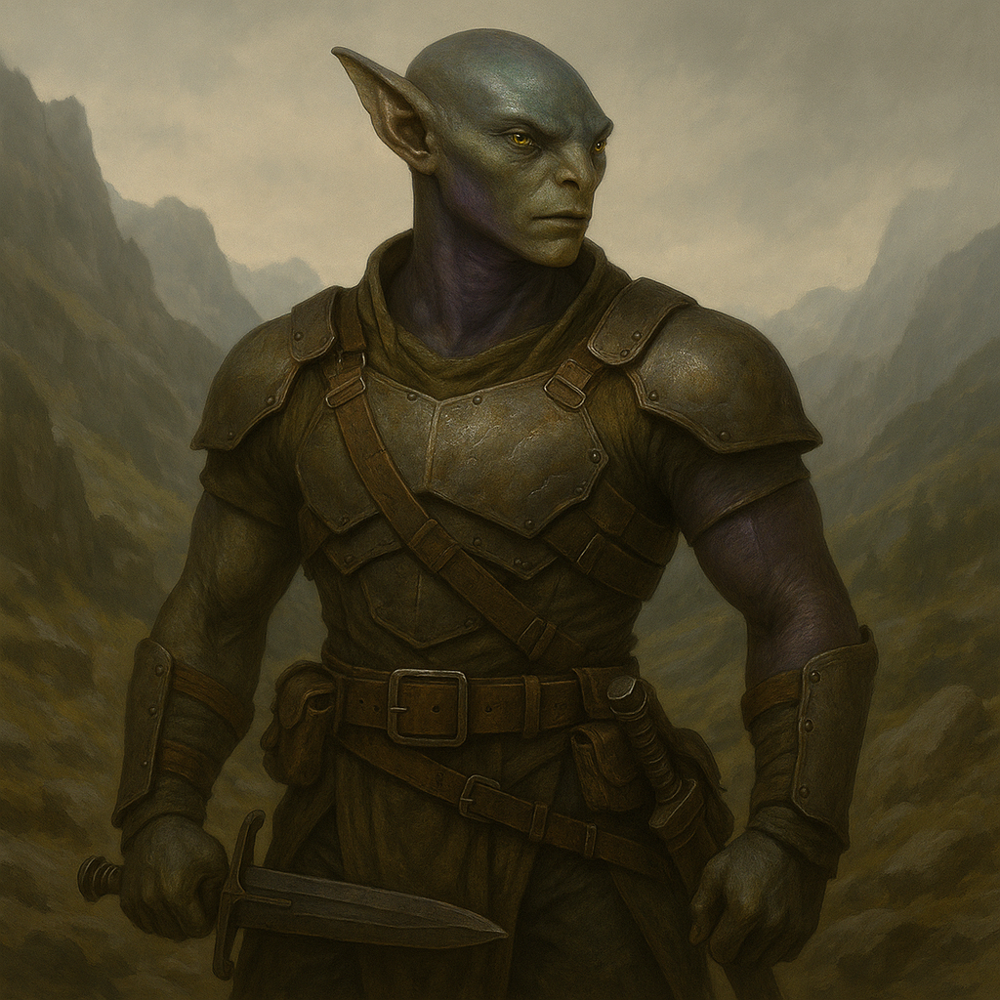

## Yrrakoth

### Description:

The Yrrakoth are tall, rangy wanderers whose supple hides shade from greenish-bronze to dusky violet depending on the lands they have lately crossed. Built for travel and for fighting at the end of it, they combine the loping endurance of migrants with the hard-packed muscle of warriors, and their angular faces are set with wide, color-shifting eyes that drink in every new country as a thing to be learned and, if need be, taken. They move with an easy, confident grace, equally at home on a mountain pass, a river delta, or a stranger's doorstep.

Yrrakoth society is organized into cohesive warrior-clans that range far and wide across the world, carrying their customs with them like portable fire. Though they wander, they are not scattered — clan bonds hold firm across vast distances, and a Yrrakoth will cross a continent to answer the war-call of kin they have not seen in a decade. Their famous flexibility is cultural as much as tactical: they adopt the tools, foods, and even the words of the peoples they encounter, folding every useful thing into their own ways while keeping the clan's loyalties unbroken. This makes them adaptable settlers and formidable foes, forever arriving in new lands already half-prepared to master them.

The Yrrakoth are aggressive and far-ranging, pressing into new territory with the hunger of a people who regard the whole world as rightfully open to them, but their warfare is flexible rather than frenzied. They probe, adapt, and reshape their methods to each new enemy, trading the headlong charge for whatever approach the ground and the foe actually reward. A Yrrakoth clan will fight ferociously for a prize it wants, yet it will also recognize when a land is not worth the blood and simply range onward to the next — their cohesion and adaptability giving them the discipline to pick their battles that pure berserkers so fatally lack.

### Notable Traits:

- Habitat: Wide-ranging clan-territories spanning many lands and climates
- Lifespan: 85 years
- Strength: Tactical flexibility, far-ranging reach, and unbreakable clan cohesion
- Weakness: Restless ambition spreads them thin across too many fronts
- Temperament: Aggressive and expansionist, yet flexible, adaptable, and clan-disciplined

### Fun Fact:

A Yrrakoth warrior's weapon is traditionally assembled from parts gathered in different lands, so that each blade carries the "memory" of every country its wielder has crossed.

---

*"The world has no walls we did not build ourselves — so walk, and take what the walking shows you."* — Yrrakoth clan-elder's counsel

[Back to Aliens](../aliens.md#yrrakoth)