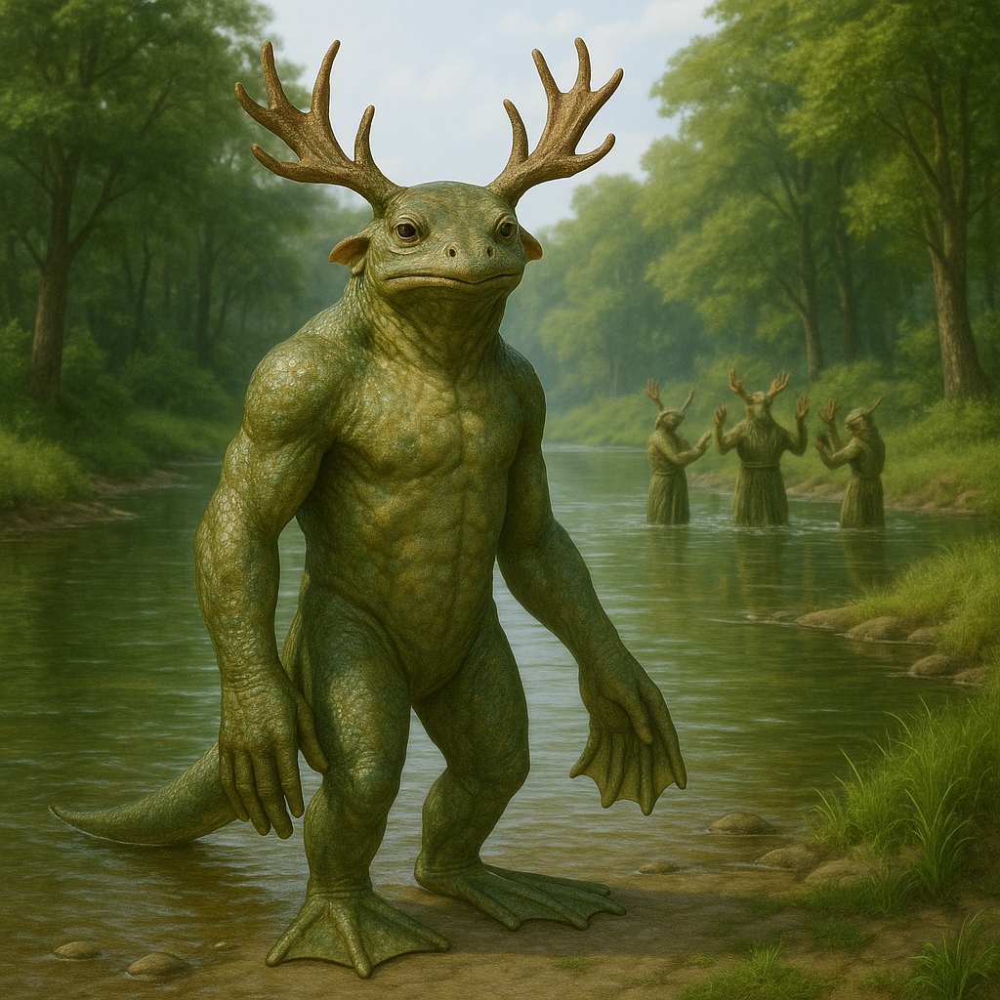

## Ythanor

### Description:

The Ythanor are an antlered, amphibious people, moss-grey and solemn, crowned with great branching racks of living bone that fork and spread like the bare limbs of winter trees. Their broad webbed hands can scoop a channel through riverbank mud or cradle a hatchling with equal ease, and their skin, kept always a little damp, carries the clean cold smell of running water. They dwell where rivers braid and divide, in the fords and shallows and crossing-places, and they regard moving water not merely as home but as the very clock and conscience of the world.

Time, for the Ythanor, is a river, and the crossing-places are its sacred hours. Their entire culture is organized around communal ceremonies held at river fords — great gatherings where whole communities wade into the shallows together to mark the turning of seasons, the coming of age, the joining of families, and the passing of the dead. They keep no calendar of numbered days; instead they reckon their history in the long sequence of crossing-rites performed at a given ford, so that a place is known not by its name but by the generations of ceremonies the water there has witnessed. To be present at a crossing is to be woven into the community's record of time itself, and an Ythanor's standing is measured by how many sacred fords it has stood in.

Their antlers, shed and regrown with the turning year, are the visible emblem of this riverine sense of time. A young Ythanor's first full rack marks its entry into adult ceremonies; an elder's great weathered crown is read like the rings of a tree, each tine and furrow a record of seasons survived. The shed antlers are never discarded but planted upright in the riverbed at the crossing-places, so that over centuries a sacred ford grows a drowned forest of ancestral bone, a literal monument to all the time that has flowed past it. Slow, grave, and deeply reverent, the Ythanor move through life at the pace of the current, distrustful of any haste that might sweep a creature past the crossings it was meant to pause and honor.

### Notable Traits:

- Habitat: River fords, braided shallows, and wide estuary flats
- Lifespan: 140–170 years, antlers regrown each season
- Strength: Amphibious and tireless in water; superb at shaping waterways
- Weakness: Slow and ceremonial; disoriented far from flowing water
- Temperament: Solemn, patient, and profoundly ritualistic

### Fun Fact:

An Ythanor measures its age not in years but in "crossings," and to ask one's age is to ask how many sacred fords it has waded through.

---

*"The river does not hurry, yet it reaches the sea; stand in the crossing, and let the time flow through you."* — Ythanor ford-rite benediction

[Back to Aliens](../aliens.md#ythanor)
