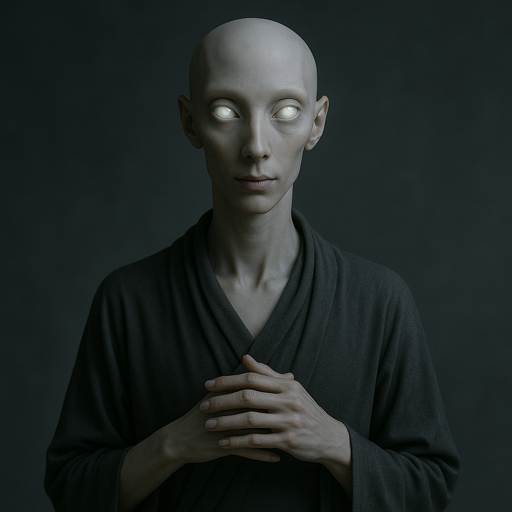

## Yttheris

### Description:

The Yttheris are slender, elongated beings whose every movement seems choreographed by some unseen inner stillness. Their many-fingered hands — often numbering a dozen delicate digits per limb — move with liquid grace, and their pale, luminous eyes glow with a soft inner light that brightens almost imperceptibly when they concentrate. Their skin is smooth and faintly translucent, like frosted glass over quiet water, and they tend to speak in low, measured tones that match the deliberate economy of their gestures.

For the Yttheris, mastery of the self is the highest of all pursuits. From their earliest years they are trained in the meditative discipline known as **the Stillwork**, a practice of breath, patience, and interior quiet that grants them extraordinary control over their own reflexes. A Yttheris can thread a needle in a storm, catch a falling vessel before it chips, or hold a single pose for hours without the slightest tremor. This precision is not merely physical skill but a spiritual achievement — to move perfectly is, in their belief, to move in harmony with the great calm that underlies the universe.

Their society is organized around meditation-halls called **Choirs of Quiet**, where practitioners of varying mastery live, study, and refine their craft together. Leadership flows not from wealth or force but from serenity: the most composed, the most unshakeable, rise to guide the rest. Yttheris customs favor silence over speech, suggestion over command, and they regard sudden or careless motion as a kind of vulgarity. Their artisans are legendary across the stars for work of impossible fineness, and their diplomats are prized for never once betraying agitation at the negotiating table.

### Notable Traits:

- Habitat: Highland temples and tranquil valleys
- Lifespan: 150–180 years
- Strength: Exceptional reflex control, precision, and composure under pressure
- Weakness: Physically frail and easily exhausted by chaos or crowding
- Temperament: Serene, contemplative, and reserved

### Fun Fact:

A trained Yttheris can balance a stacked tower of glass vessels through a tremor that would topple any other hand.

---

*"The hand that hurries spills; the hand that waits is never wrong."* — Yttheris proverb

[Back to Aliens](../aliens.md#yttheris)
