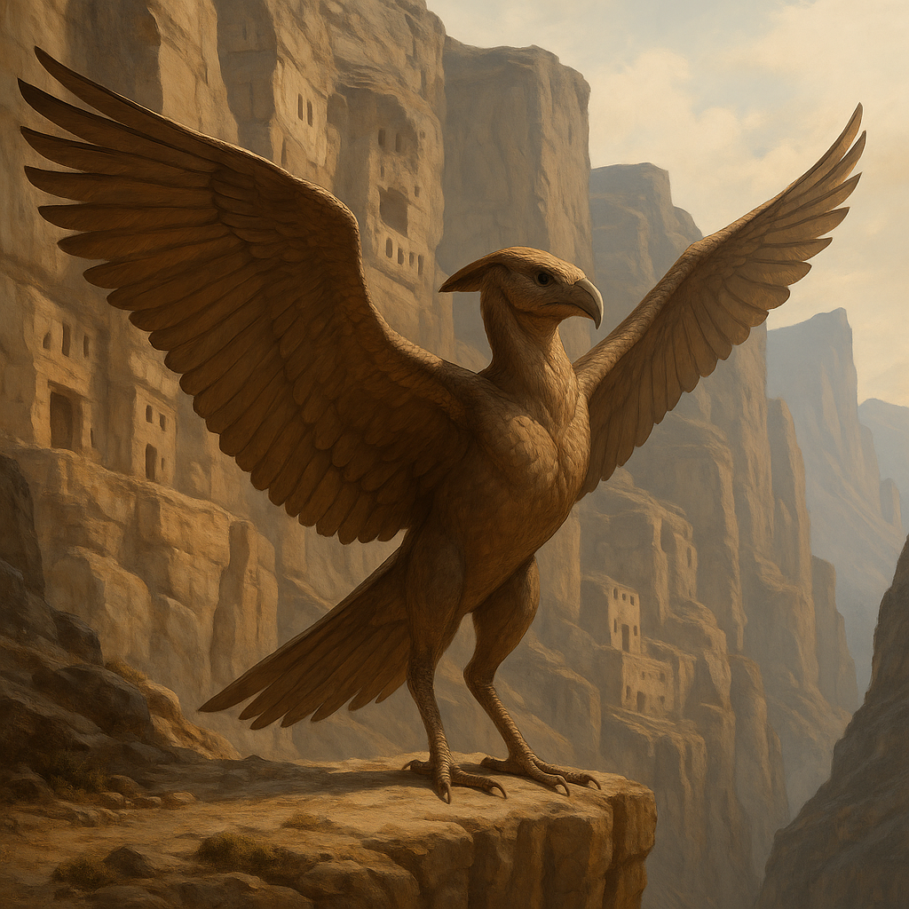

## Zaethmor

### Description:

The Zaethmor are broad-winged, cliff-dwelling beings, lean and sinewy, their arms extending into great leathery pinions that fold tight against their bodies at rest and unfurl into a span wider than they are tall. Their bones are hollow, their chests deep and powerful, their eyes sharp enough to pick a single stone from a valley floor far below. They nest in the sheer faces of the highest cliffs, in eyries carved from the living rock where no groundbound creature could ever climb, and more than most highland peoples they build as well as roost — hewing out their aeries and stringing fortified waystations along the heights for the long climbing-flights between them — and they look down upon the lowlands with the serene detachment of a people who have quite literally risen above them.

The Zaethmor are a devout folk, and the shape of their faith is written in stone and altitude: they believe that holiness increases with height, that the thin cold air of the summits is closer to the divine, and that a life's spiritual progress is marked by the pilgrimages one makes to ever-higher and more sacred peaks. Across their lives the Zaethmor undertake these climbing-flights to distant holy summits, each pilgrimage harder and higher than the last, until the most revered elders have stood upon pinnacles so lofty and remote that few others will ever follow. To reach a sacred height is to touch the sacred itself, and the greatest shame a Zaethmor can know is to have grown so comfortable in the lowlands that it ceased, in life, to climb.

Their broad wings grant them a gift that is also the heart of their contemplative temperament: the ability to glide for hours upon the rising thermals and updrafts that curl along their cliffs, circling effortlessly on motionless wings while the land turns slowly below. For the Zaethmor this soaring is not mere travel but meditation, a floating stillness in which the mind empties and the spirit rises with the warm air; they do their deepest thinking aloft, and a Zaethmor faced with a hard decision will take to the sky and ride the currents until the answer settles. This has made them a patient, far-seeing, and somewhat aloof people, inclined to view the frantic struggles of the ground-bound with a certain lofty pity, yet capable, when they choose to descend, of a sudden swift decisiveness that catches the lowlanders entirely by surprise.

### Notable Traits:

- Habitat: Sheer cliffs, high crags, and the updrafts above mountain valleys
- Lifespan: 120–150 years
- Strength: Can glide for hours on rising air; keen-eyed and far-seeing, and apt at carving aeries and waystations into the heights
- Weakness: Awkward and vulnerable on the ground; need wind and height to thrive
- Temperament: Serene, devout, and loftily detached

### Fun Fact:

A Zaethmor never says it has "decided" something — it says it has "landed," because every true decision is made in the air and only brought back to earth once settled.

---

*"The lowland eye sees the next step; the soaring eye sees the whole road, and whither it leads."* — Zaethmor pilgrim's meditation

[Back to Aliens](../aliens.md#zaethmor)
