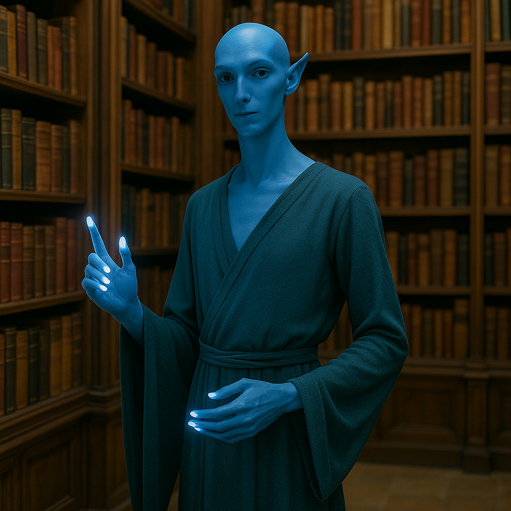

## Zaethys

### Description:

The Zaethys are slender, elegant scholars with skin in cool shades of deep blue, their long fingers tipped with points that glow with a soft inner luminance. That light is no mere ornament: the Zaethys can sense electrical currents in the world around them, feeling the crackle of a storm long before it breaks, the pulse of living nerves, and the faint fields woven through metal and stone. Where their luminous fingertips brush a surface, they read its hidden currents the way others read a printed page.

Knowledge is the great passion of the Zaethys, and their civilization is built, quite literally, around the preservation of it. Their temples are also their libraries, soaring halls where towering shelves of records surround altars of accumulated wisdom, and where to study is to worship. A Zaethys enters a temple-library not to petition a god but to add to and draw from the vast reservoir of understanding their people have gathered across the ages. The pursuit of a new truth is, to them, the holiest of acts, and ignorance the only sin that cannot be forgiven.

Their sensitivity to electrical currents has shaped a deeply inquisitive and precise culture. Zaethys scholars can read the living electricity of another's body — the quickening of a lie, the glow of recognition — making them subtle and perceptive, hard to deceive and gentle in their insight. They organize themselves into Disciplines, scholarly orders devoted to particular domains of study, and advancement comes solely through contribution to knowledge. The Zaethys believe that the universe itself is a vast text written in current and charge, and that their luminous fingertips are the gift by which they are meant, patiently and reverently, to read it.

### Notable Traits:

- Habitat: Highland academies and temple-libraries
- Lifespan: 170 years
- Strength: Senses electrical currents; vast scholarly tradition
- Weakness: Physically frail; prone to overcautious deliberation
- Temperament: Curious, precise, and reverent toward knowledge

### Fun Fact:

A Zaethys can tell whether a visitor is nervous, lying, or merely cold simply by reading the faint electrical currents dancing across their skin.

---

*"To read the current is to read the mind of the world."* — Zaethys temple inscription

[Back to Aliens](../aliens.md#zaethys)
