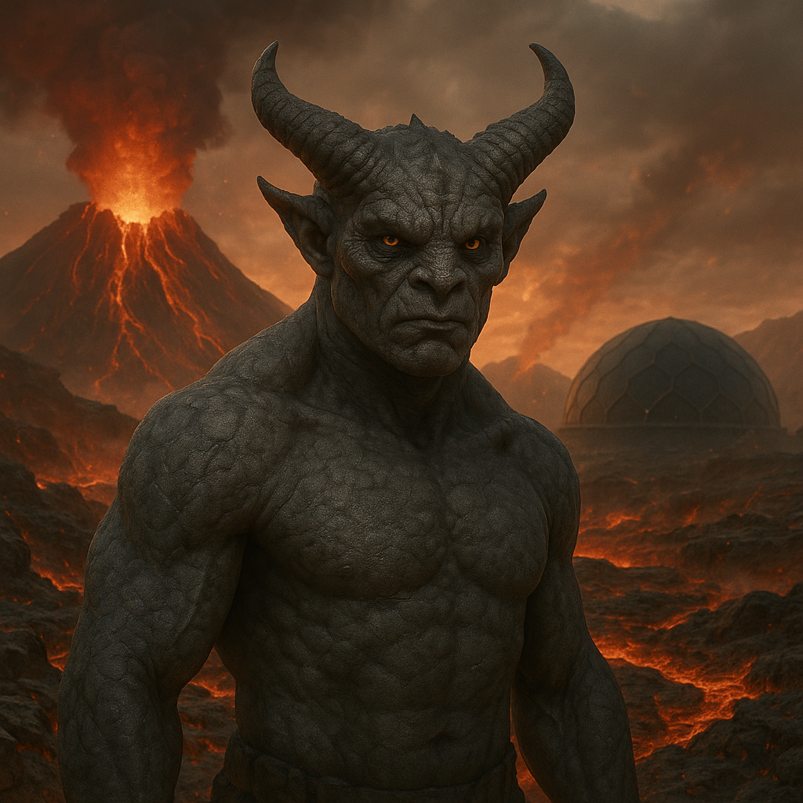

## Zathurex

### Description:

The Zathurex are a horned, ash-colored people, hard-skinned and grim-eyed, their hides the dusty grey of cooled cinder and their brows crowned with blunt, upswept horns that darken toward their tips like scorched iron. Born upon rugged volcanic worlds of smoking vents and black glassy badlands, where the ground itself is apt to crack and bleed fire, the Zathurex are a people forged in adversity, and they carry the harshness of their homeland in every line of their stern faces and every clipped, unsentimental word they speak. They are not an easy people to love, but they are a very hard people to break.

Their defining belief is as plain and unyielding as the stone they live upon: that hardship tempers character, and that nothing worth having is ever won in comfort. The Zathurex deliberately make their lives difficult, scorning ease as a slow poison and treating adversity as a teacher to be sought rather than avoided. Their children are raised with a sternness that outsiders mistake for cruelty, set tasks just beyond their strength so that in failing and trying again they are "quenched," as the Zathurex say, like hot metal plunged into cold water. To coddle a Zathurex is to insult it; to challenge one is to honor it. Their heroes are not the lucky or the gifted but the enduring, those who walked through fire — often quite literally — and came out harder.

The volcanic furnace of their homeworld has made the Zathurex extraordinarily resistant to smoke and heat; they breathe choking fumes that would fell other peoples and wade through searing air with no more than a squint. This immunity is both a practical gift and the cornerstone of their self-image, for they regard themselves as the people the fire could not kill, tempered where others would be consumed. It makes them peerless miners, smiths, and workers of the deep hot places, and it lends their culture a flinty pride that borders on arrogance. Yet beneath the grim exterior runs a current of fierce, flinty loyalty: a Zathurex that has judged you worthy — that has watched you endure and not break — will stand by you in any fire, and such hard-won regard, once given, is almost never withdrawn.

### Notable Traits:

- Habitat: Volcanic badlands, ash plains, and the smoking slopes of mountains
- Lifespan: 150–190 years, hardened by harsh living
- Strength: Highly resistant to smoke and heat; peerless miners and smiths
- Weakness: Harsh and inflexible; mistrust comfort and dismiss the untested
- Temperament: Stern, resilient, and fiercely proud

### Fun Fact:

A Zathurex congratulates a newborn not with wishes for an easy life, but with the solemn hope that it will face "many good hardships."

---

*"The blade unquenched is only soft iron pretending; let the fire do its work before you call yourself strong."* — Zathurex forge-saying

[Back to Aliens](../aliens.md#zathurex)
