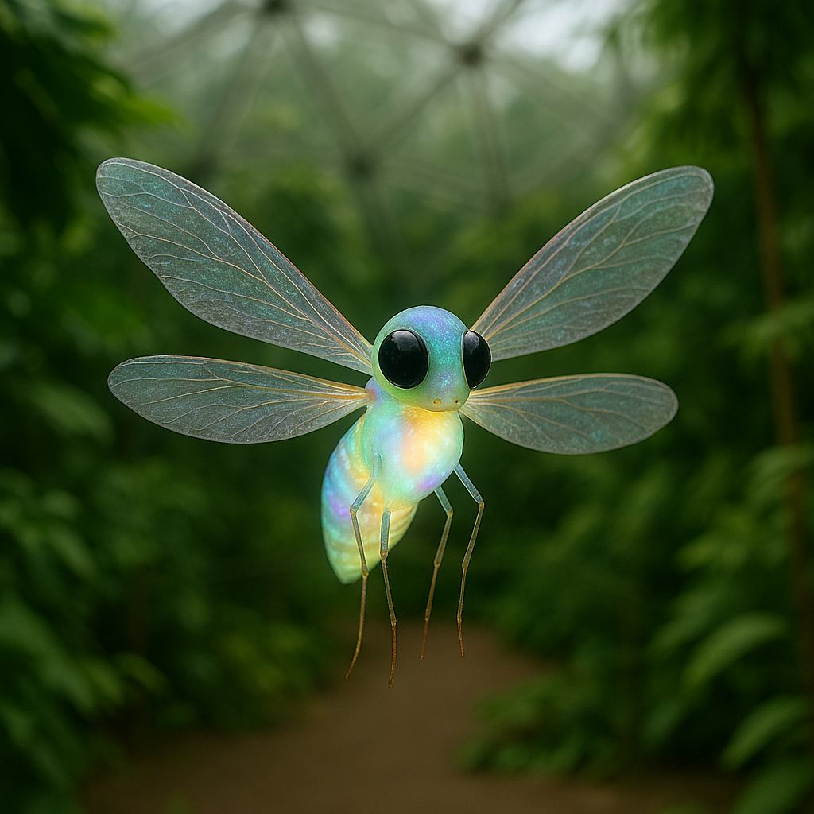

## Zayllux

### Description:

The Zayllux are small, delicate fliers no larger than a child's forearm, their bodies shimmering with an iridescence that shifts from violet to gold depending on the angle of starlight. Four translucent wings beat in a mesmerizing counter-rhythm, allowing them to hover, dart, and drift with the precision of a thought. Their most striking feature is a pair of enormous black eyes that drink in the faintest glimmer of distant suns, giving them night vision so acute they can read the sky as easily as others read a page.

To the Zayllux, the heavens are not empty but written. Every constellation is a sacred map, a story, and a set of directions all at once, and their entire civilization is organized around the reading of starlight. Young Zayllux spend their first years memorizing the Great Weave — the vast web of named stars by which their people navigate not only space but the course of their lives. They do not build toward the ground but toward the sky, raising airy lattice-cities among high cliffs and tall trees, open to the night so that the stars are never out of sight.

Their religion holds that each Zayllux is assigned a guiding star at hatching, and that upon death their spirit flies to join it, becoming a new point of light for future generations to steer by. Priests called Skyreaders interpret the slow procession of constellations to set the calendar of festivals, migrations, and matings. Because their navigation depends entirely on clear skies, the Zayllux harbor a deep cultural dread of cloud and fog, and their most solemn mourning rituals are reserved for the rare storm-season nights when the Great Weave vanishes and the people must, terrifyingly, find their own way.

### Notable Traits:

- Habitat: High cliffs and canopy roosts
- Lifespan: 40 years
- Strength: Unerring celestial navigation and agile flight
- Weakness: Fragile bodies, disoriented by overcast skies
- Temperament: Dreamy, reverent, and curious

### Fun Fact:

A Zayllux can recite the position of over nine thousand stars from memory, but famously cannot remember where it set down its own cup.

---

*"Lose the ground if you must, but never lose the sky."* — Zayllux Skyreader teaching

[Back to Aliens](../aliens.md)

[Back to Aliens](../aliens.md#zayllux)
