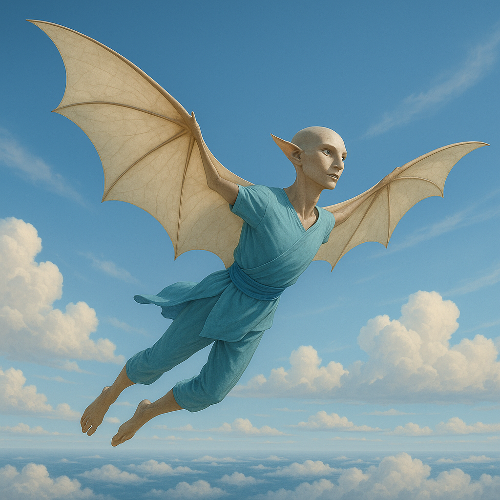

## Zephkar

### Description:

The Zephkar are a lightweight, hollow-boned people built for the open sky, their slender frames spanned by broad membranes of sail-like skin that stretch between their outstretched limbs. When these membranes catch the wind they unfurl into gleaming living sails, and a Zephkar leaps from a high crag to soar for hours on the thermals, riding the air with the effortless mastery of a people born to it. Their skin is pale and faintly iridescent, their eyes keen and far-seeing, and their bodies so light that a strong gust can lift them from a standing start.

To the Zephkar, the wind is no mere weather but a living presence — the great Breath that gives, takes, carries, and guides. Their religion is built upon it, their calendar follows the turning of the seasonal winds, and their holiest shrines are perched upon the highest peaks where the Breath blows strongest and purest. They speak of the wind as one might speak of a wise and capricious elder: to be honored, heeded, and never taken for granted. A Zephkar who dies is said to be "taken up by the Breath," their spirit carried off on the next great gale.

Their lives aloft have made the Zephkar peerless navigators of the skies. They read the subtlest shifts of air pressure, the texture of clouds, and the behavior of distant birds to chart invisible highways through the heavens, and a Zephkar sky-pilot can find a safe path through a storm that would dash any other flier from the air. This mastery shapes their restless, far-ranging culture: the Zephkar think nothing of soaring vast distances to trade, visit, or simply wander, and they regard the earthbound existence of other species as a kind of pitiable confinement.

Zephkar settlements cling to cliff-faces and mountain spires, built upward and outward into the wind rather than hunkered against it, open to the sky on every side. Their society is loose and freedom-loving, suspicious of walls both literal and figurative, and bound together less by territory than by shared skyways and the common reverence for the Breath. Proud, independent, and exhilarated by motion, the Zephkar pity nothing so much as a creature that cannot fly.

### Notable Traits:

- Habitat: High cliffs, peaks, and the open skies above them
- Lifespan: 80 years
- Strength: Masterful gliding flight and unrivaled skill at reading the winds
- Weakness: Fragile, light-boned frames poorly suited to ground combat or heavy labor
- Temperament: Free-spirited, proud, and reverent toward the wind

### Fun Fact:

A Zephkar considers it the deepest insult to be carried indoors against their will, for to be shut away from the wind is, to them, a kind of imprisonment of the soul.

---

*"Trust the Breath, for it has carried every one of us who ever flew."* — Zephkar proverb

[Back to Aliens](../aliens.md#zephkar)
