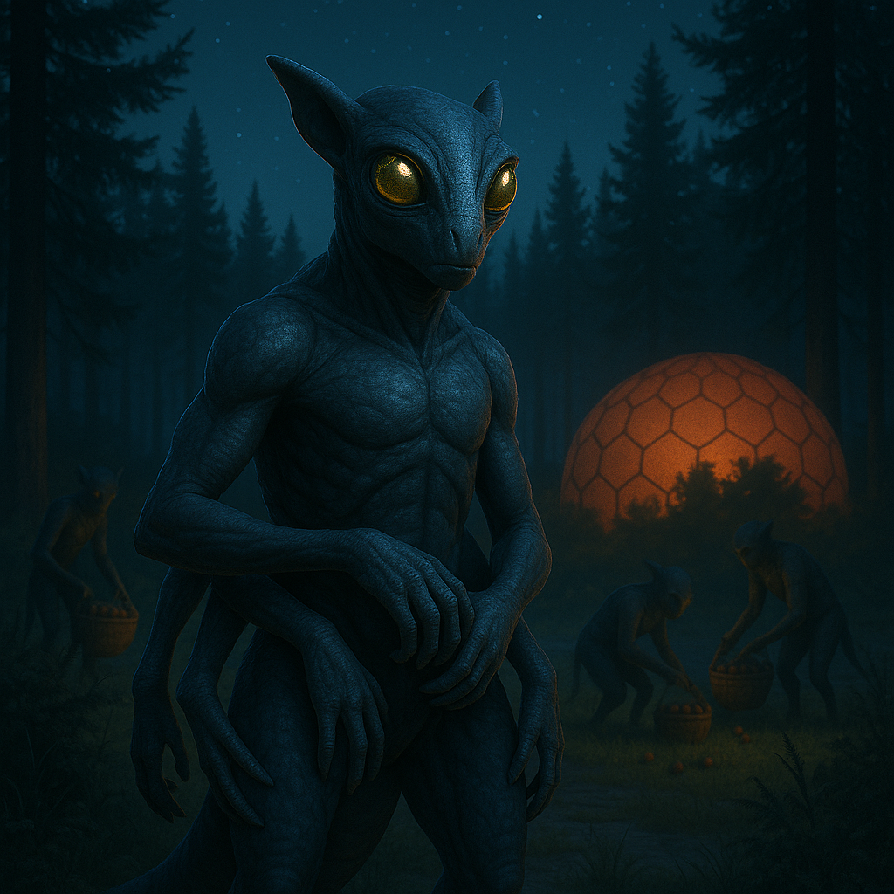

## Zundareth

### Description:

The Zundareth are six-limbed, nocturnal gatherers whose large, mirror-bright eyes gather the faintest glimmer of starlight and throw it back in a soft, eerie shine. Covered in fine, dark fur that drinks the shadows, they move through the night on four lower limbs while two nimble upper limbs pluck, sort, and carry. Their world is one of scent, sound, and the silver half-light of the dark hours, and they find the full glare of day harsh and overwhelming.

Though they are creatures of the night, the Zundareth hold the **dawn** as sacred. Each night's gathering ends with the laying out of **offerings to the coming light** — the finest of what was collected, arranged upon flat stones to greet a sun its makers will scarcely see before sleep takes them. It is a poignant devotion: they honor most what they experience least, revering the dawn as a promise rather than a presence, a boundary between the known night and the mysterious bright world beyond their waking hours.

Their society is organized into close-knit gathering-bands that range widely under the stars, and status among them is measured by generosity — by how much one brings back and how willingly it is shared and given to the dawn. The Zundareth are gentle, watchful, and a little melancholy, folk of thresholds and in-between times. Their songs are hushed, their customs quiet, and their deepest wisdom is reserved for that fleeting grey moment when night surrenders to morning and the whole band pauses, just once, to watch the light they have offered finally arrive.

### Notable Traits:

- Habitat: Forests, caverns, and twilight scrublands
- Lifespan: 70–100 years
- Strength: Superb night vision, agility, and skilled foraging
- Weakness: Overwhelmed and nearly blind in bright daylight
- Temperament: Gentle, watchful, and reverent

### Fun Fact:

A Zundareth will carry the choicest berry of an entire night's foraging untouched, just to lay it at the dawn-stone as the sky begins to pale.

---

*"We give our best to the light we barely know, and in the giving, we are known to it."* — Zundareth proverb

[Back to Aliens](../aliens.md#zundareth)
