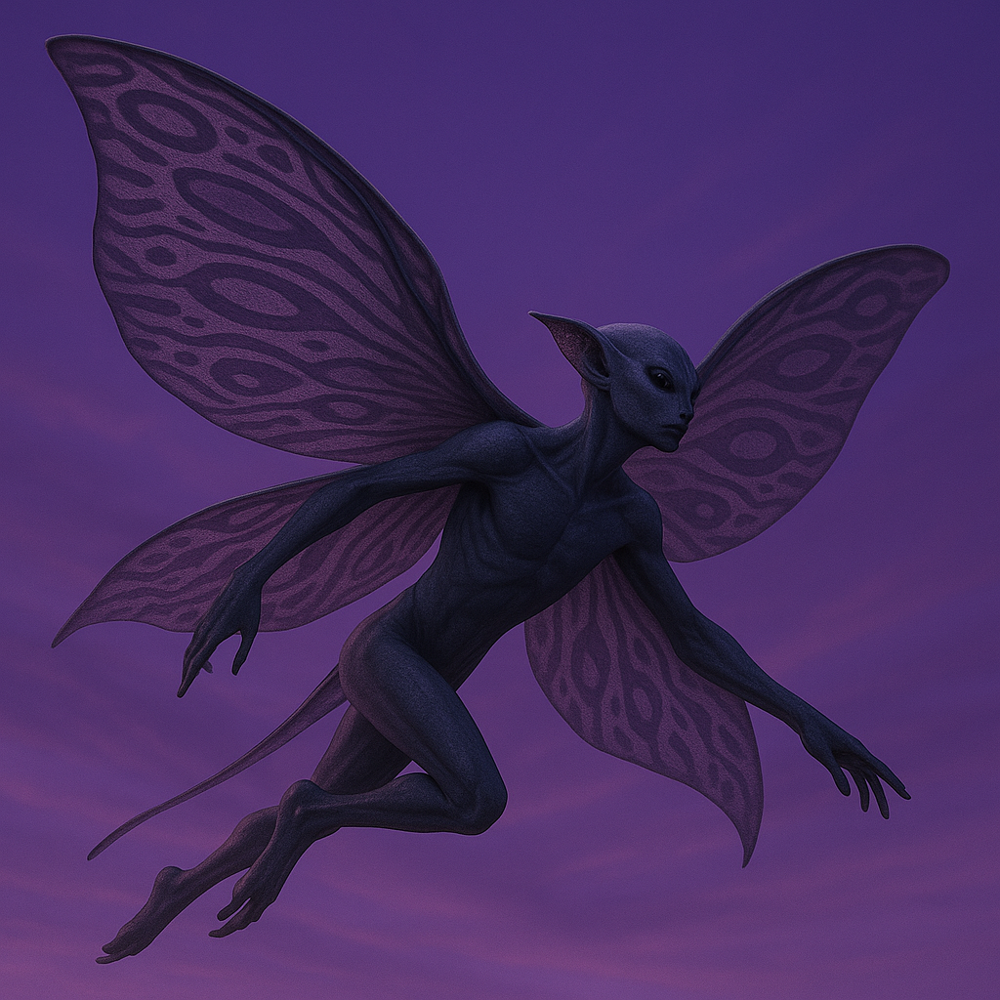

## Zunveil

### Description:

The Zunveil are elegant, veil-winged fliers whose great gossamer wings are draped with shifting, kaleidoscopic patterns that ripple and rearrange themselves like oil upon water. Slender and ethereal, they drift through the air on these broad translucent veils, and no two moments find a Zunveil's wings bearing quite the same design. Their faces are half-hidden behind folds of their own wing-veils even at rest, for the Zunveil are a people who hold concealment itself to be a kind of grace.

Privacy is the cornerstone of Zunveil civilization, elevated to the highest of virtues. They consider the unguarded exposure of one's thoughts, feelings, or affairs to be not merely imprudent but indecent, and their elaborate codes of courtesy are built around the careful management of what is revealed and what is kept veiled. To pry into another's concealed matters is a grave offense; to volunteer one's own too freely is seen as a lack of self-possession. A Zunveil's inner life is a private garden, shown only to the most trusted few, and only ever in part.

Their shifting wing-patterns are both the emblem and the instrument of this creed. In flight a Zunveil can ripple its veils into a bewildering flux of color and shape that breaks up its own outline, confusing the eye and making it nearly impossible to track — a living camouflage woven from pure pattern. This gift of visual misdirection suffuses their art, their fashion, and their diplomacy alike; the Zunveil delight in ambiguity, in the half-said and the suggested, and they regard bluntness as both rude and crude.

Socially the Zunveil are reserved, formal, and subtly hierarchical, organized into discreet houses that guard their affairs behind layers of ritual and indirection. Negotiations among them are famously opaque to outsiders, conducted in a dance of veiled implication where the most important things are never stated outright. Graceful and enigmatic, the Zunveil can seem cold or evasive to blunter peoples, but within the trusted circle of a Zunveil house there flows a quiet, loyal warmth — all the more treasured for being so rarely unveiled.

### Notable Traits:

- Habitat: Misty highlands, cloud-wreathed peaks, and sheltered aerial roosts
- Lifespan: Moderate — around 100 years
- Strength: Flight and pattern-shifting wings that disrupt their outline and confound pursuit
- Weakness: Secretive to a fault; mistrust and indirection breed misunderstanding
- Temperament: Private, formal, and enigmatic

### Fun Fact:

A fleeing Zunveil can ripple its wings so chaotically that pursuers lose track of which of several blurred shapes is the real one.

---

*"What is veiled is kept; what is shown is given away."* — Zunveil house-maxim

[Back to Aliens](../aliens.md#zunveil)
