
## Buildings

#### Biodome

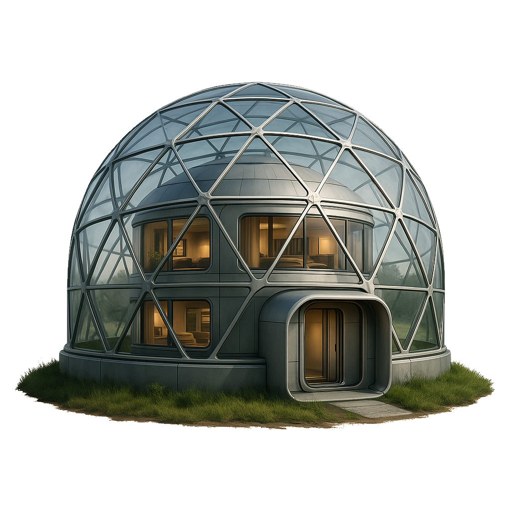

The Biodome is the heart of a colony, establishing its central hub and initial zone of control. Its tile is always worked, providing all the living quarters for a growing population. The building boosts the colony’s baseline growth rate and grants starting storage for Food, Material, Energy, Wealth, and Happiness. Functioning as a self‑contained city, the Biodome includes limited solar power generation, hydroponic food production, fresh‑water extraction (via wells or nearby rivers), and basic manufacturing. It also holds modest reserves of energy (batteries), food, water, and warehouse space. Drones attached to the Biodome can explore beyond its borders and can monitor neighboring colonies.

#### Habitat

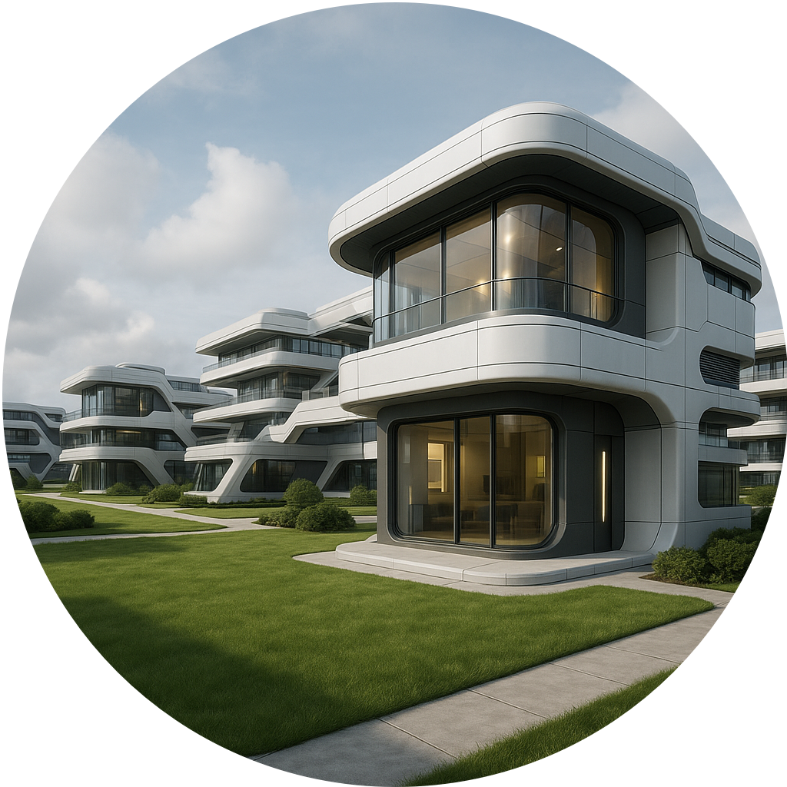

The Habitat is dedicated housing — the fastest way to grow a colony past the point where its lone Biodome runs out of room. Where every other structure merely tends the land, the Habitat builds *up*, stacking living quarters, life‑support, and community space into a dense arcology that both quickens population growth and lifts the ceiling on how many colonists a colony can hold. It may be built on flatland, forest/jungle, or low‑mountain terrain (`flatland`, `trees`, `mountain-low`), and has no building prerequisite. Construction is substantial — **200 Material**, **100 Wealth** and **2 Water** over **3 turns** — and each year it consumes **50 Energy**, **5 Food**, **30 Goods**, **30 Material**, **3 Water** and **50 Wealth** to keep its systems and residents running. In return a worked Habitat adds **+1%** to the colony's population growth rate and a **+0.5** happiness bonus, pays back **50 Wealth** per year, and — crucially — provides **20 000 Population** storage, raising the colony's hard population cap. It also adds modest storage for Energy (**50**), Food (**10**), Goods (**250**), Water (**6**) and Happiness (**25**). Work several Habitats and a colony can swell far beyond what the land alone would support.

#### Solar Panels

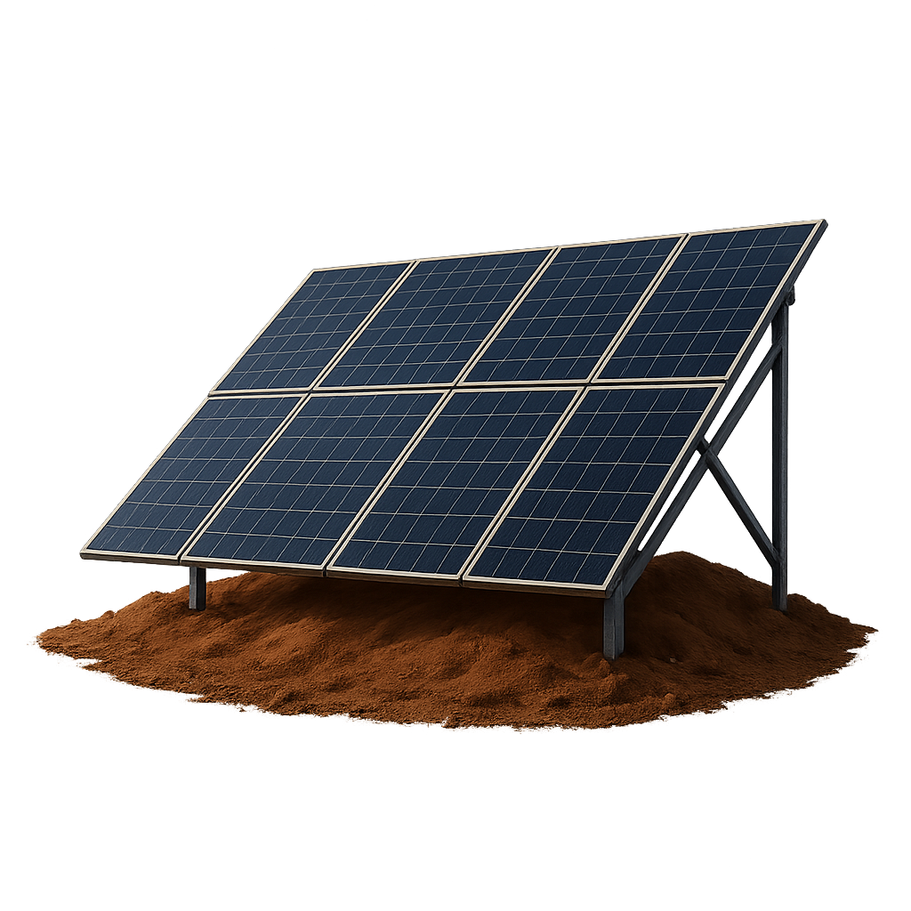

Solar Panels are advanced energy collectors. They cost 2 Material, 2 Energy and 2 Wealth to construct (takes 1 turn) and have a yearly upkeep of 0.5 Wealth. Each panel produces 6 Energy per year and adds 500 Energy storage to the colony, while providing no food, material, wealth or growth bonuses.
 
#### Farm

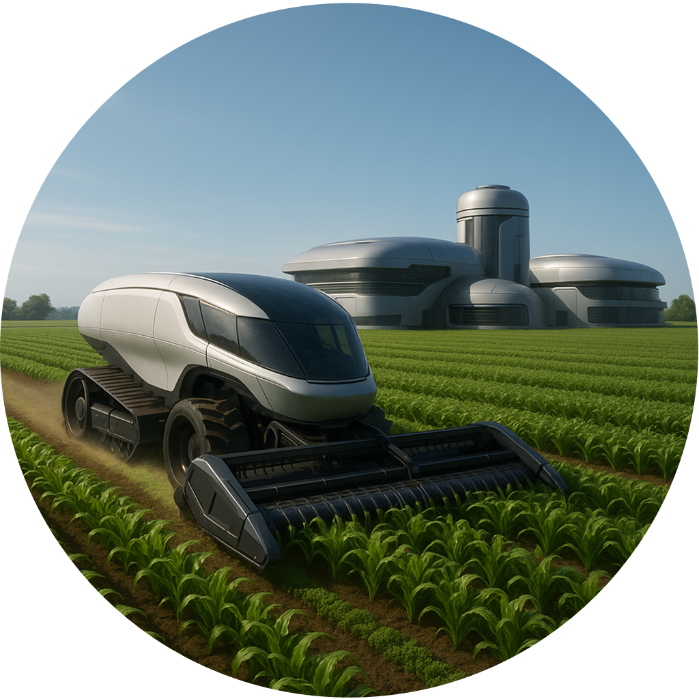

The Farm is the advanced food production facility for your colony.  It can be built only after a Solar Panel is present. Construction requires **3 Material**, **2 Energy**, and **2 Wealth** and takes **1 turn**. Upkeep each year is **1 Material**, **1 Energy**, and **0.5 Wealth**. Each Farm yields **3 Food** per year, contributes **1 Wealth**, and provides a modest growth boost of **0.0025**. It also adds **500 Food** storage and **100 Energy** storage to the colony.

#### Aquafarm

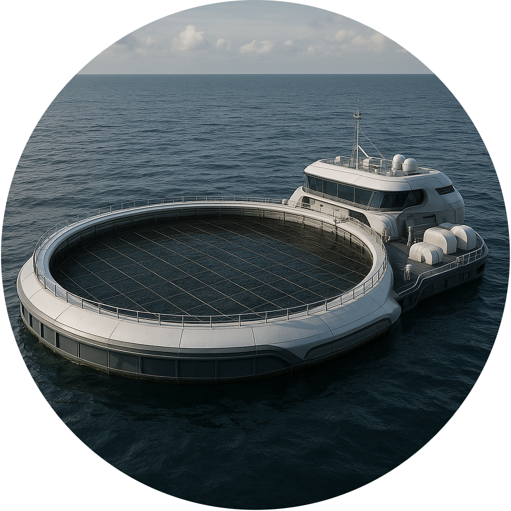

The Aquafarm is the sea's answer to the Farm — a floating lattice of pens, kelp racks, and shellfish beds that harvests food from the water instead of the land. It is built on a **shallow‑sea tile** (sea adjacent to land) within the colony's zone of control and requires a **Dock** in the colony first (the Dock opens the colony's sea tiles to work and gives the Aquafarm its harbor). Like the Farm, its food yield is a **multiplier of the tile it stands on**: it adds **3× the cell's own Food** (sea base food plus any food resource deposit there), so productive, bonus‑rich shallows are the prime sites. Construction costs **10 Energy**, **20 Material**, **10 Wealth** and **0.25 Water** over just **1 turn**, and each year it consumes **0.2 Energy**, **5 Material** and **5 Wealth**. Besides its food, it brings in **25 Wealth** per year and adds **25 Food** storage. For coastal and island colonies — where arable land is scarce but shallow sea is plentiful — the Aquafarm is the mainstay of the food supply.

#### Mine

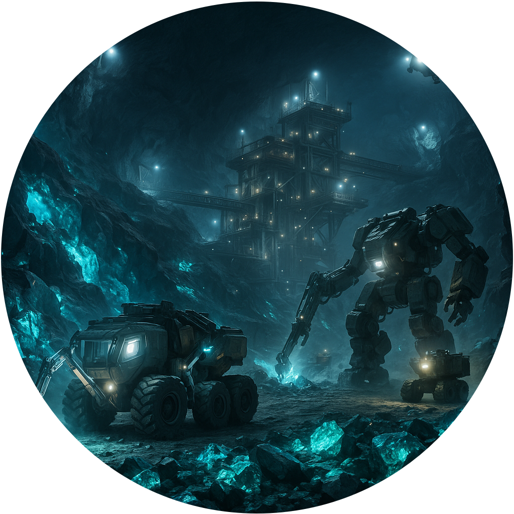

The Mine is the colony's dedicated material producer, carving ore and stone straight out of the ground. Its output is a **multiplier of the tile it stands on**: rather than a flat yield, a Mine produces **10× the cell's own Material** (terrain base + any Material resource deposit there). On a rich mountain tile that is an enormous haul, so Mines are best planted on the most mineral‑dense ground you can reach. It requires a **Solar Panel** in the colony and may be built on any land terrain. Uniquely, the Mine's **`mining`** trait lets it work ground other buildings avoid — the high, cold, and broken terrain where ore is richest — though the **impassable mountain tops (tier‑9 peaks) remain off‑limits to everyone**. Construction costs **5 Material**, **5 Energy**, **10 Wealth** and **0.5 Water** over **3 turns**, and each year it draws **50 Energy**, **5 Goods** and **5 Wealth** to run its machinery. It adds **500 Material** storage. A single well‑sited Mine can single‑handedly feed a colony's Factories and keep its road network supplied with Material.

#### Factory

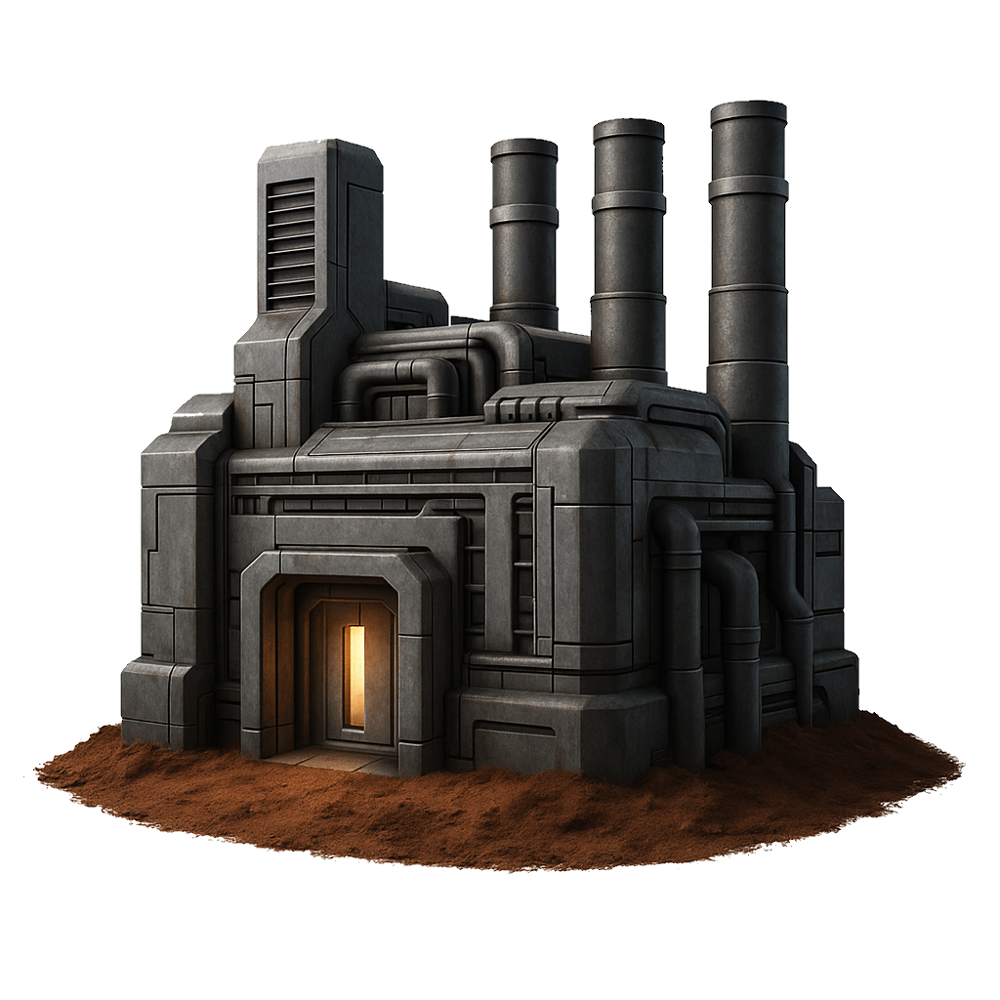

The Factory is a building that can create 3-D printed goods.  It requires a Solar Panel before it can be constructed. It costs **5 Material**, **5 Energy** and **5 Wealth** and takes **3 turns** to build. Each year it requires **2 Material**, **3 Energy** and **1 Wealth**. It produces **5 Material** per year, adds **1 Wealth**, reduces growth by **0.0025** and lowers happiness by **0.5**. It also expands the colony’s storage by **500 Material** and **200 Energy**.

#### Dock

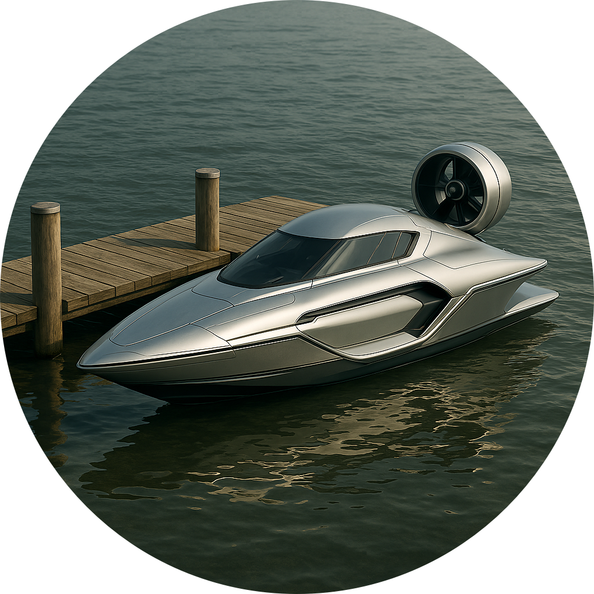

The Dock creates a shallow‑sea transportation network, linking colonies that also have Docks so they can share resources across sea tiles. A Dock sits on a
  shallow-sea tile, opens the colony's shallow-sea tiles to being worked, and
  lets colony-launch paths cross shallow sea (to reach islands and cross straits). It requires a Solar Panel in the colony. Construction costs **1 Material**, **1 Energy** and **1 Wealth**, and takes **2 turns**. Each year it costs **1 Energy** and **1 Wealth** to maintain, provides **1 Food** and **1 Wealth**, and adds **300 Food** and **300 Material** storage.

#### Port

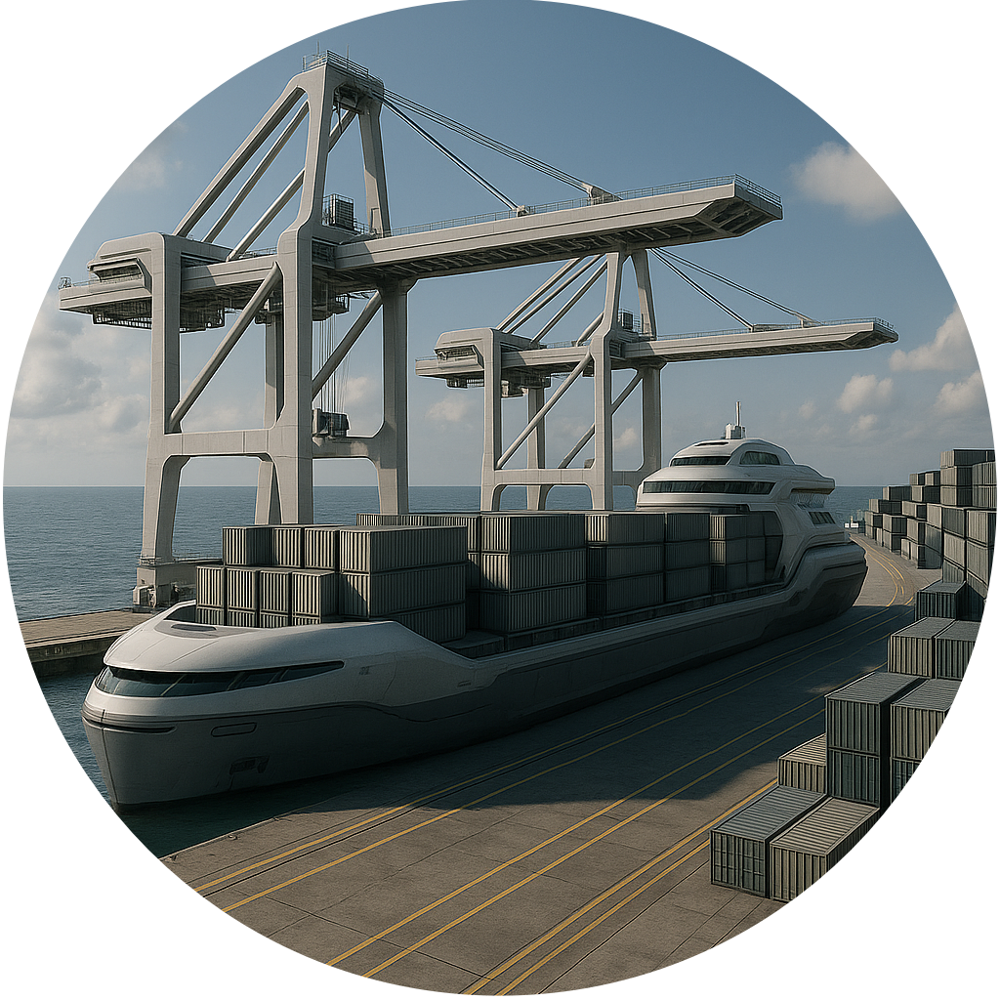

The Port is the Dock's big sibling — a full deep‑water harbor that opens travel across **all** sea routes, not just the shallow coastal waters a Dock reaches. Where a Dock lets ships and launch paths cross only shallow sea, a Port's owner can route across the **open ocean** too, linking far‑flung island and coastal colonies that no Dock could reach. It is built as an **upgrade of an existing Dock**: you can only build a Port on a cell that already holds one of your Docks, and doing so **replaces** that Dock in place (it still requires a Solar Panel in the colony). Construction costs **40 Material**, **10 Energy**, **20 Wealth** and **0.5 Water** over **2 turns**, and each year it costs **10 Energy**, **6 Wealth** and **0.2 Water** to run its cranes and berths. In return it produces **10 Food** and **15 Wealth** per year and adds **10 Food** and **100 Goods** storage. For a seafaring empire, upgrading a key coastal Dock to a Port is what turns scattered holdings into one connected maritime network.

#### Air Field

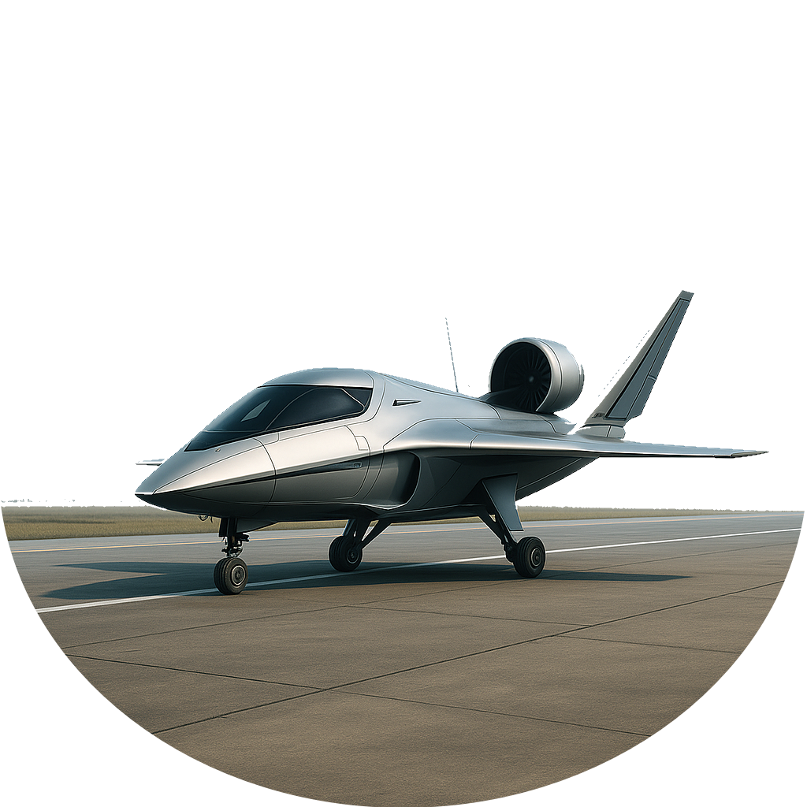

The Air Field creates an air‑transportation network, linking colonies that also have Air Fields within **16 tiles** so they can share resources. It requires a **Factory** before it can be built. Construction costs **2 Material**, **2 Energy** and **2 Wealth** and takes **2 turns**. Each year it costs **1 Energy** and **1 Wealth** to maintain, provides **2 Wealth** per year, and adds **300 Food** and **300 Material** storage.

#### Airport

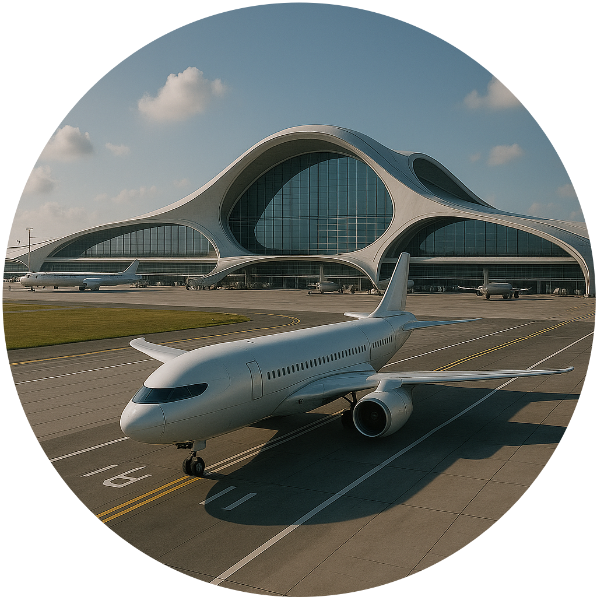

The Airport is the Air Field's big sibling — a full international hub that extends the air‑transport network far beyond a modest airstrip. It links air‑connected colonies out to a **range of 40 cells** (versus the Air Field's shorter reach), so upgrading one key hub can suddenly tie distant colonies into the shared network. It is built as an **upgrade of an existing Air Field**: you can only build an Airport on a cell that already holds one of your Air Fields, and doing so **replaces** that Air Field in place (an Airport still counts as an Air Field for anything that requires one, such as the Spaceport). It still needs a **Solar Panel** and a **Factory** in the colony. Construction costs **120 Material**, **40 Energy**, **30 Goods**, **120 Wealth** and **5 Water** over **3 turns**, and each year it costs **100 Energy**, **20 Goods**, **25 Wealth** and **0.5 Water** to run. In return it provides **25 Wealth** and a **+0.5** happiness bonus, and adds **40 Energy**, **100 Food** and **250 Goods** storage. For a sprawling empire, a well‑placed Airport is what stitches far‑flung colonies into one air network.

#### Barracks

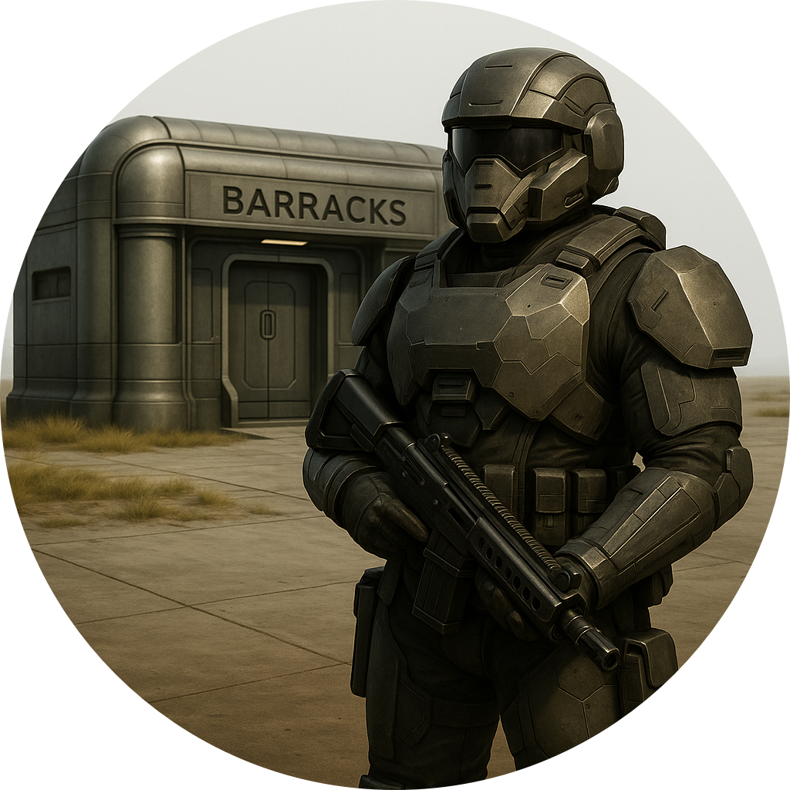

The Barracks train military battalions for defense and offense. It requires a **Factory** before it can be built. Construction costs **2 Material**, **2 Energy** and **2 Wealth**, and takes **2 turns**. Each year it consumes **1 Food**, **1 Energy** and **1 Wealth**, and provides a happiness bonus of **0.5**.
 
 ### Granary 
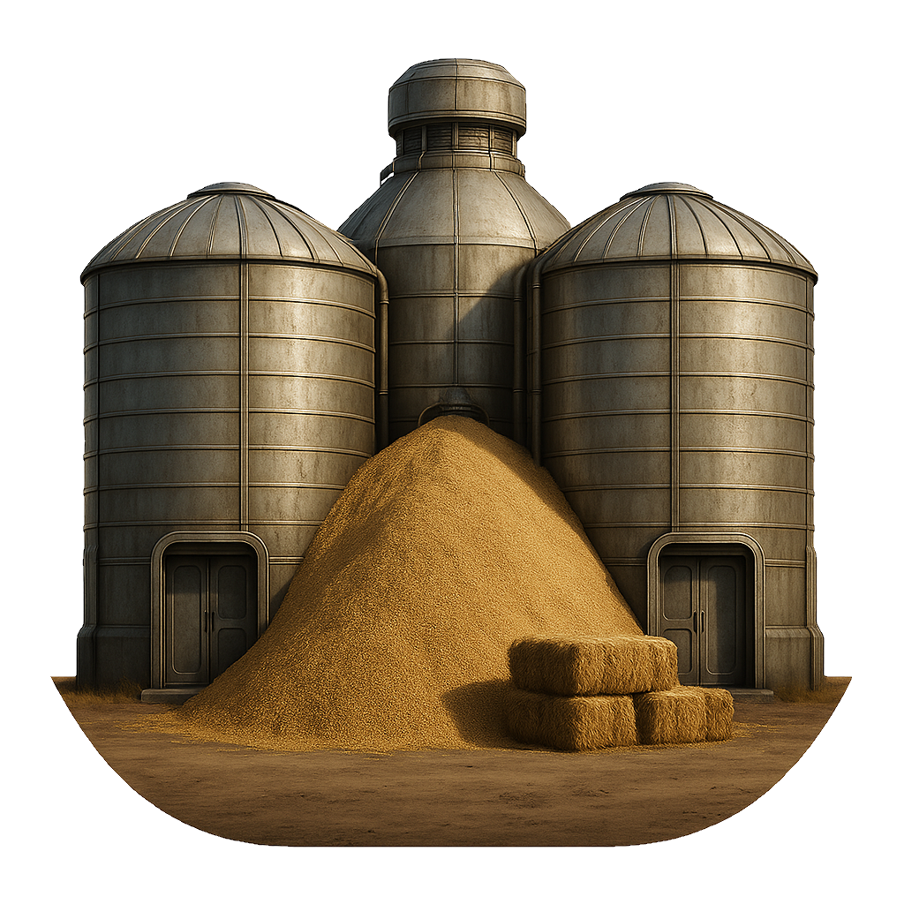

The Granary provides large‑scale food storage, increasing a colony’s food capacity by **1 000**. It can be built after a **Farm** is built.  It costs **2 Material**, **2 Energy** and **2 Wealth**, taking **2 turns** to construct. It has no upkeep or production bonuses.

#### Materials Depot

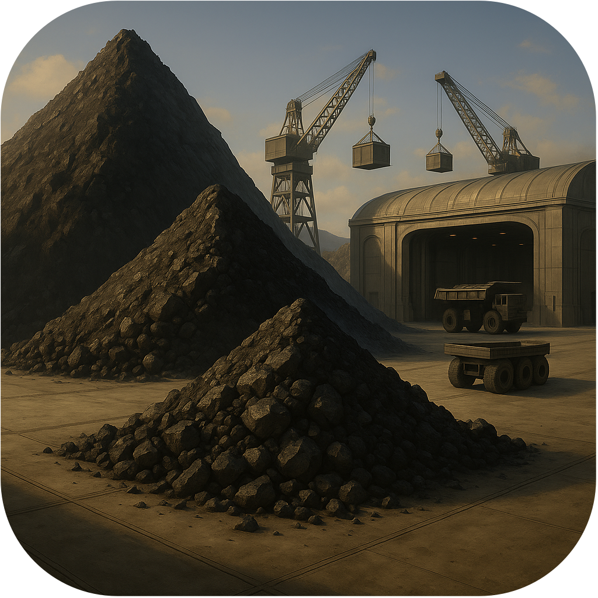

The Materials Depot is bulk storage for raw **Material** — the ore, stone, and timber mined and harvested from the land before it is refined into Goods. It increases a colony’s Material storage capacity by **1 000**, giving mining‑heavy colonies somewhere to stockpile the raw stock that feeds their Factories (which convert Material into manufactured Goods). It can be built after a **Factory** is present, costs **10 Material**, **2 Energy** and **4 Wealth** over **1 turn**, and carries a small yearly upkeep of **1 Energy** and **1 Wealth**. It produces nothing on its own — it is the raw‑materials counterpart to the Warehouse, which stores finished Goods.

#### Warehouse

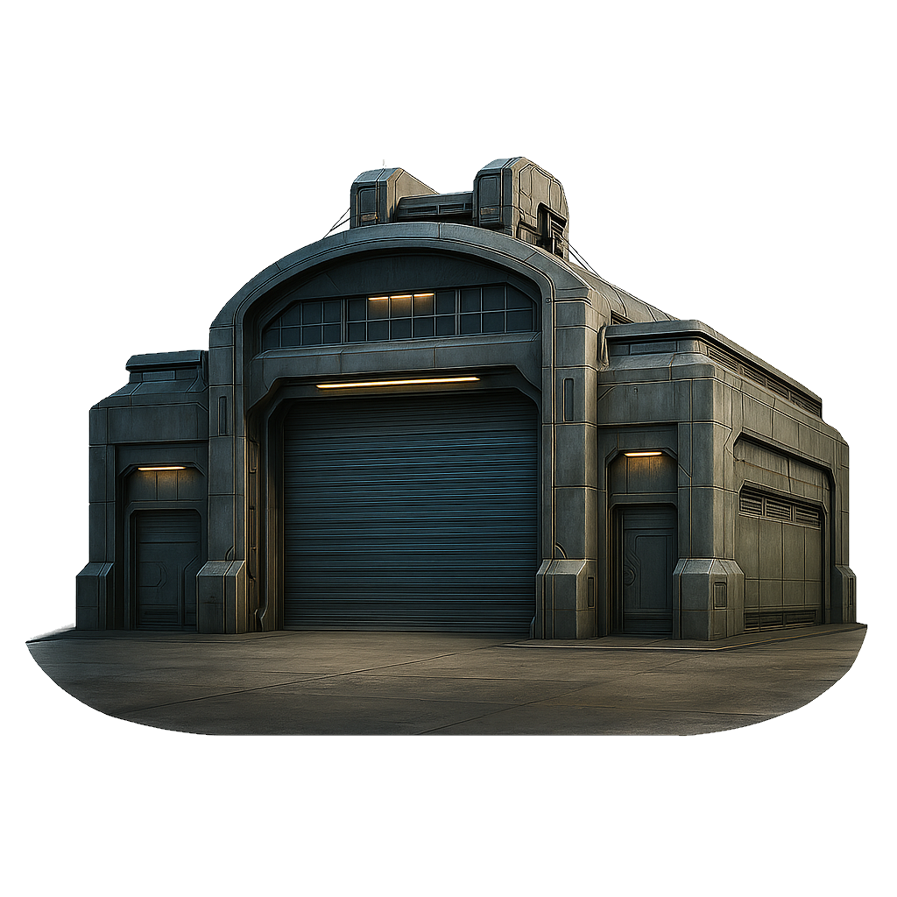

The Warehouse boosts manufactured goods storage capacity by **1 000 Goods**. It can be built after a **Factory** is built, costs **2 Material**, **2 Energy** and **2 Wealth**, and takes **2 turns** to construct. It has no upkeep or production bonuses, serving solely as a large goods warehouse.

#### Bank

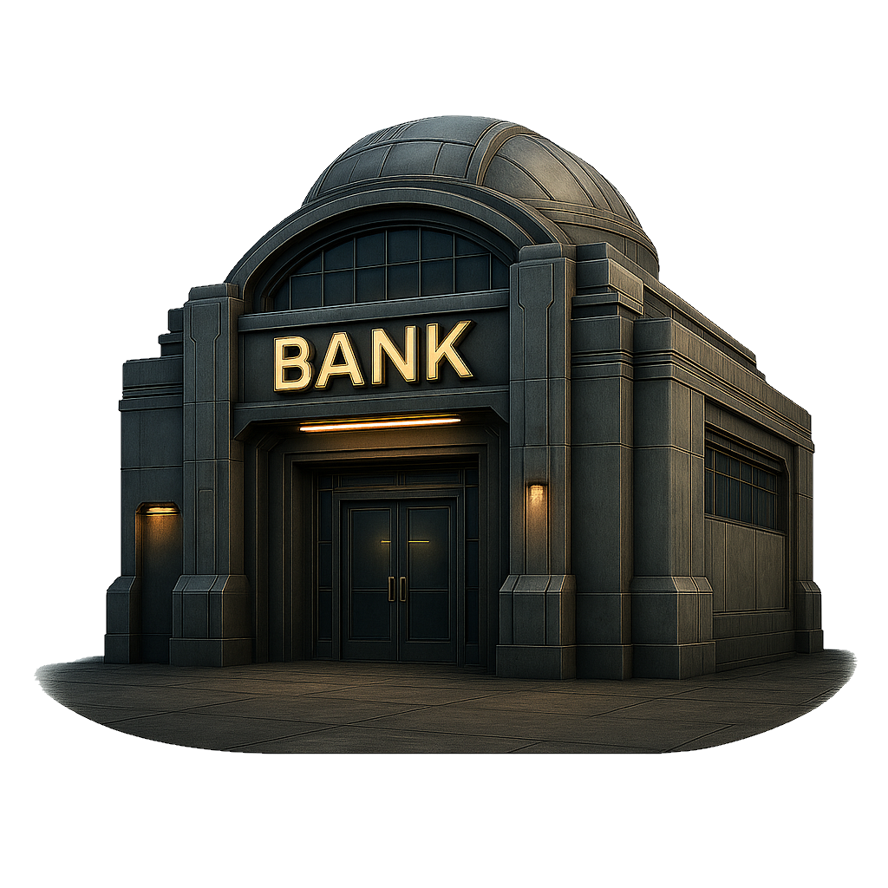

The Bank speeds up the colony’s economy and enables more advanced building projects. It requires a **Solar Panel** before it can be built. Construction costs **2 Material**, **2 Energy** and **2 Wealth**, and takes **2 turns**. Each year it consumes **1 Energy** and **1 Wealth**, but generates **3 Wealth** per year, adds a happiness bonus of **0.5**, and provides **1 000 Wealth** storage.

#### Compressed-Air Energy Storage

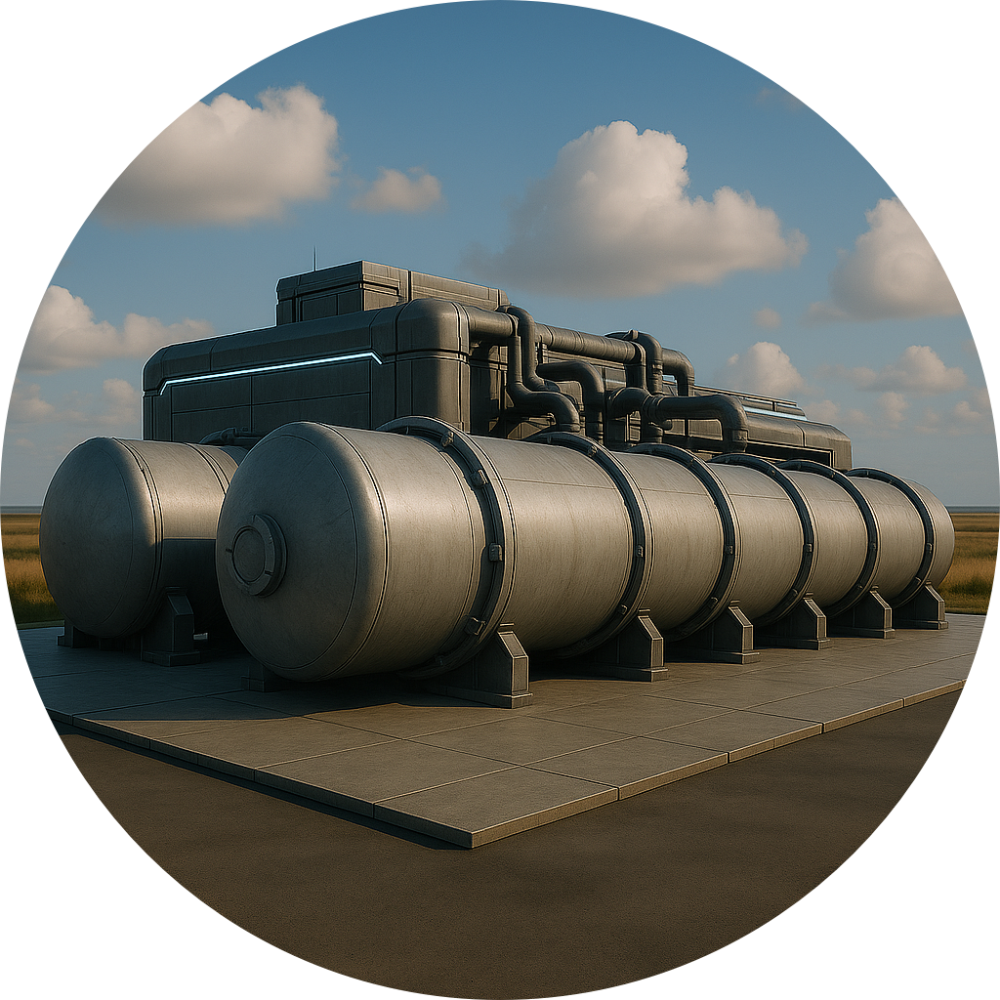

The Compressed‑Air Energy Storage (CAES) is an advanced energy storage facility. It requires a **Bank** before it can be built. Construction costs **4 Material**, **2 Energy** and **2 Wealth**, and takes **2 turns**. Each year it consumes **1 Energy** and **1 Wealth**, and provides **1 000 Energy** storage for the colony.

#### Water Treatment Plant

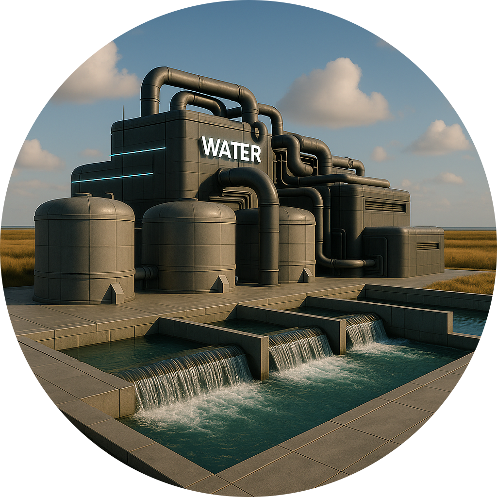

The Water Treatment Plant (WTP) draws from a nearby river or canal and purifies it into clean fresh water for the colony's people, farms, and industry. It must be built on a habitable land tile (grassland, hills, forest, jungle, desert, or plains) that sits **adjacent to a river or canal**, and it requires a **Solar Panel** in the colony first. Construction costs **40 Material**, **30 Energy**, **1 Water** and **50 Wealth**, and takes **3 turns**. Each year it consumes **40 Energy**, **4 Material** and **2 Wealth** to run its pumps and filtration. In return it produces **140 Water** per year and adds **200 Water** storage to the colony — the mainstay water supply for any colony settled along the planet's inland waterways.

#### Desalination Plant

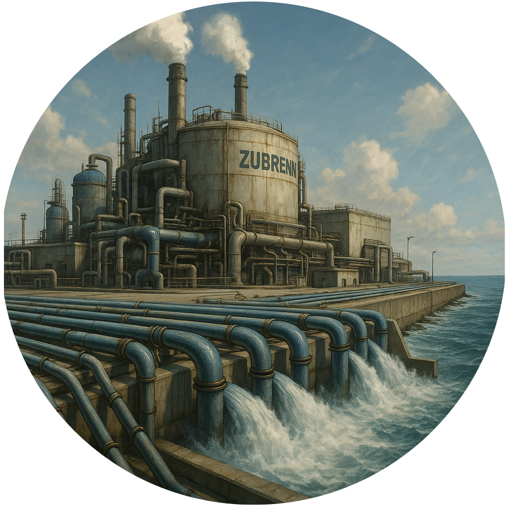

The Desalination Plant turns the limitless sea into drinkable water, built on a **shallow‑sea tile** (sea adjacent to land) within a colony's zone of control. It requires a **Solar Panel** in the colony. Construction is a major undertaking — **200 Material**, **5 Energy**, **1 Water** and **100 Wealth**, over **3 turns** — reflecting the vast reverse‑osmosis works it entails. Its hallmark is a voracious appetite for power: each year it consumes **250 Energy**, along with **30 Material** and **5 Wealth** for membranes and upkeep. In return it delivers **70 Water** per year and provides **200 Water** storage. Where a river‑fed Water Treatment Plant isn't an option, desalination keeps coastal and island colonies alive — provided they can feed its enormous energy demand.

#### Spaceport

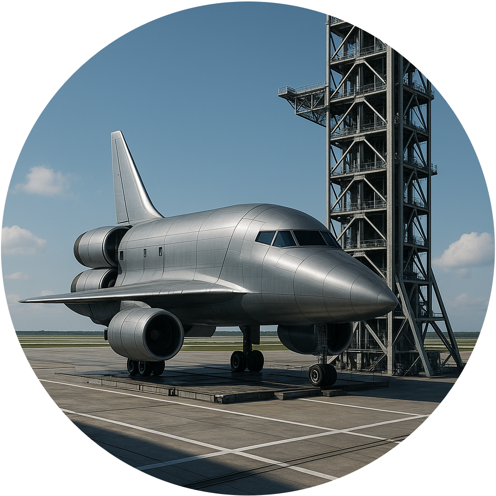

The Spaceport opens the **space transport network** — the only link with **no range limit at all**. Any two of your colonies that each raise a Spaceport are connected and share resources no matter how far apart they lie or what terrain divides them. It is a late‑game capstone that requires an **Air Field** first. Construction costs **100 Material**, **5 Energy**, **1 Water** and **50 Wealth** over **2 turns**, and each year it consumes **100 Energy**, **10 Material**, **0.5 Water** and **20 Wealth** to keep its launch systems running — in return it provides **15 Wealth** and a small happiness bonus. Spaceports can only be built in a **tropical** climate band. (Climate restrictions are configurable per building via a `climate` list in `config.json`.)

#### Drone Base

The Drone Base is a self‑contained forward reconnaissance outpost that can be placed on any visible cell outside a colony’s zone of control, granting a 16‑tile visibility radius and real‑time intelligence on neighboring colonies. Powered by its own solar panels and linked wirelessly to the nearest colony, its construction (10 Material, 1 Energy, 5 Wealth, 1 turn) and upkeep (1 Energy, 3 Wealth per year) are funded by the Federation. Deployment requires route planning: the base travels from the nearest colony, with travel time reduced by roads or monorails, and can only cross shallow sea when a Dock is present (deep‑sea crossings await the future Deep Water Port).