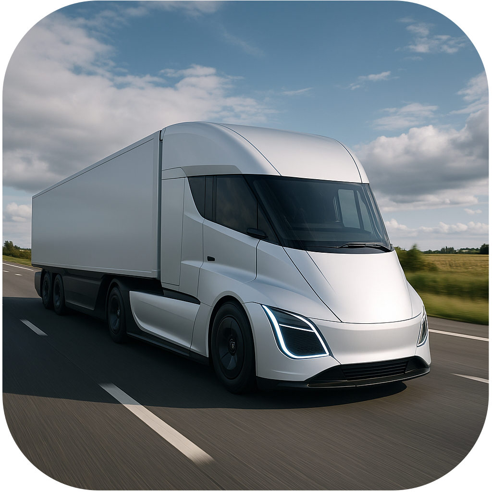
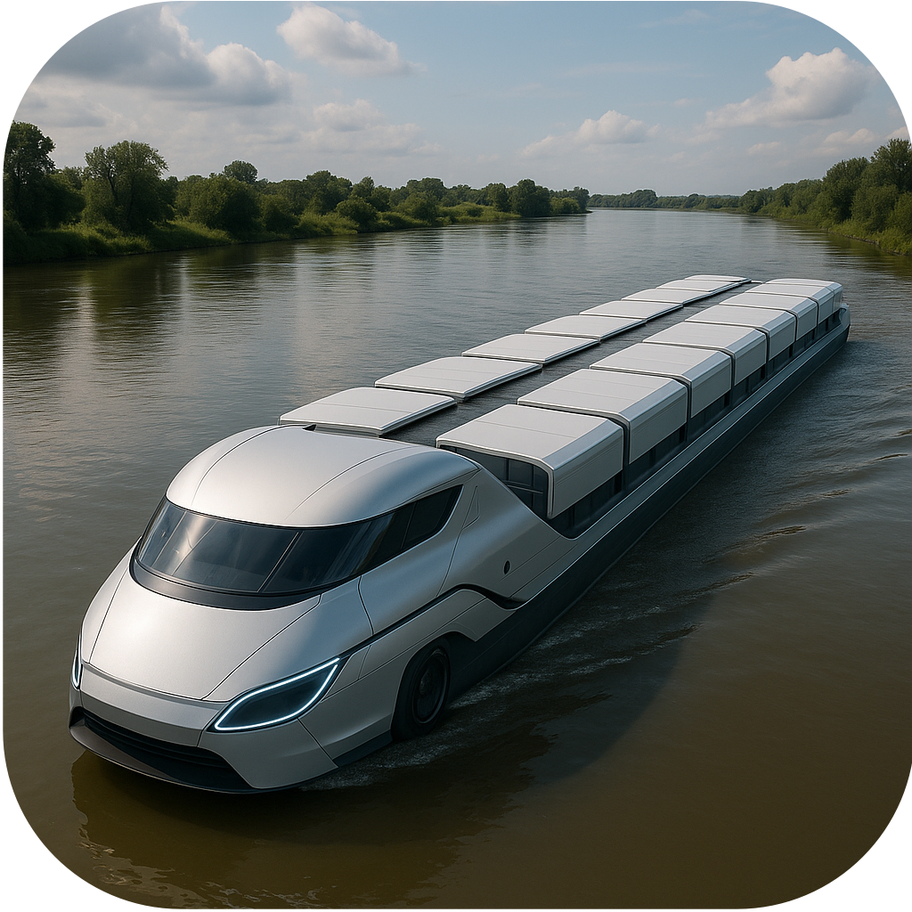
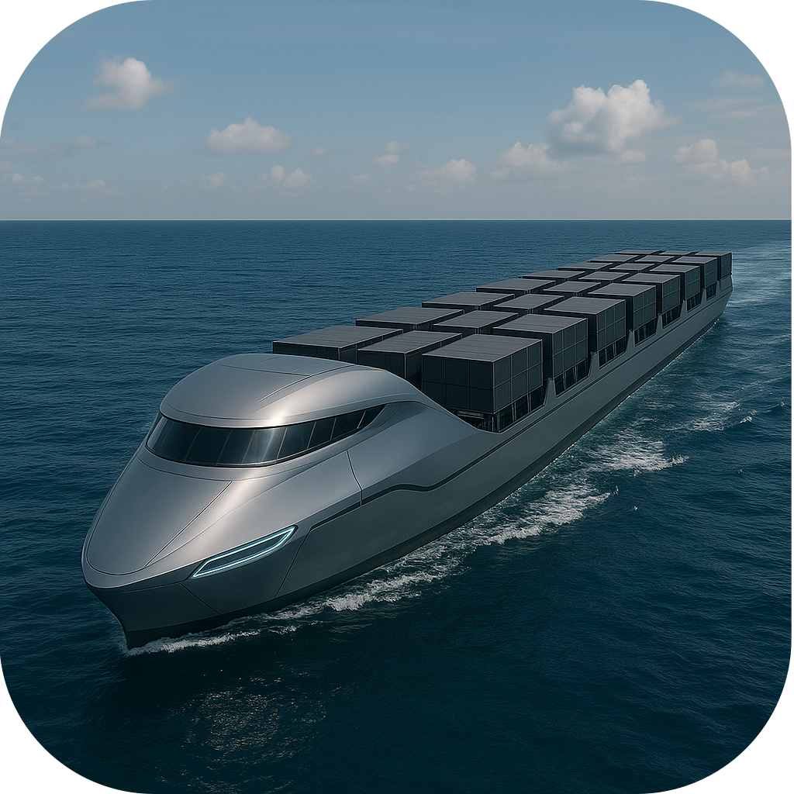
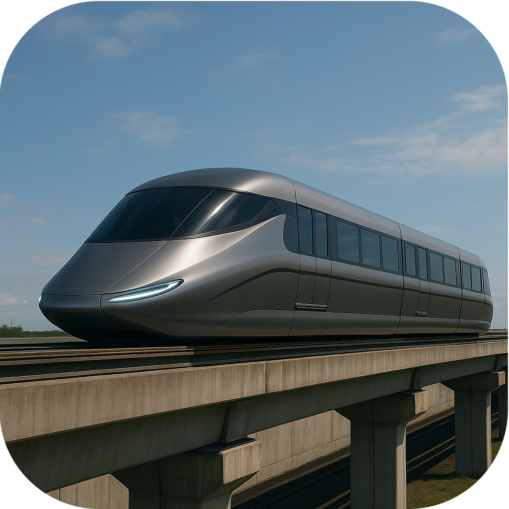
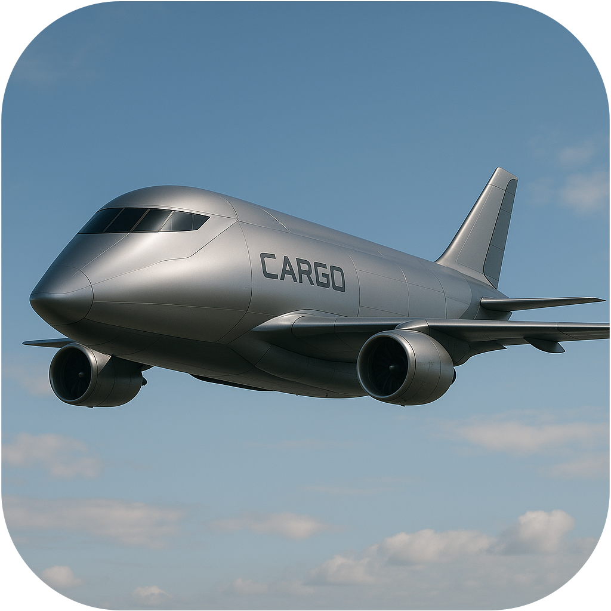
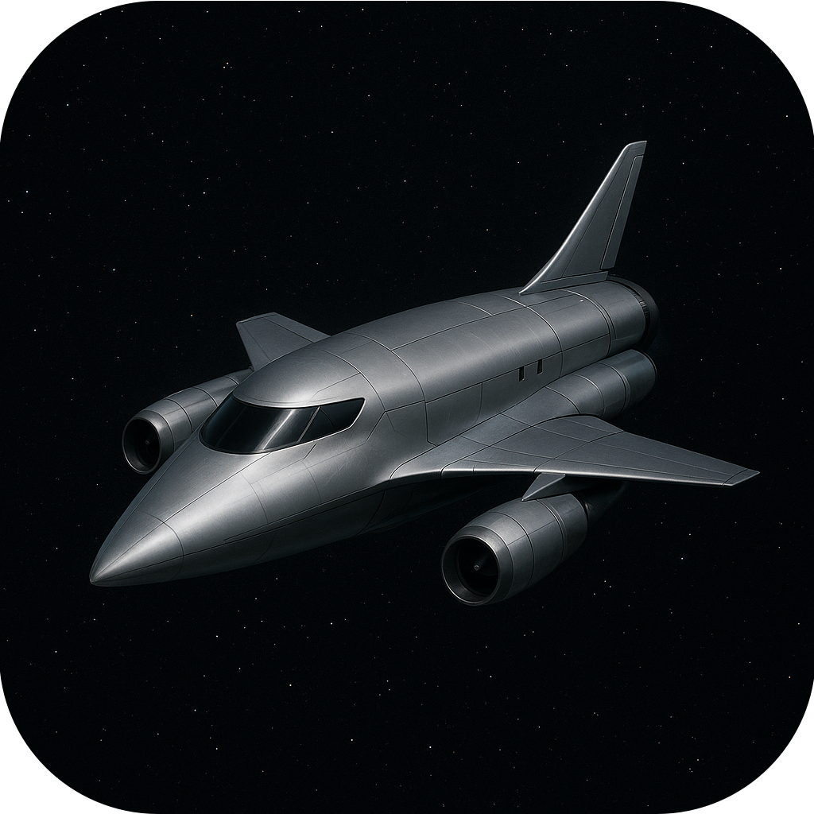

## Transportation

Colonies do not stand alone. By weaving them together into a **transportation
network**, you let connected colonies share resources — a colony short on a
resource draws from whichever connected colony has the most to spare, and
surplus beyond what a colony can hold flows into the Federation pool. Only
colonies linked to the capital can draw from (or contribute to) that pool, so
laying good connections is what turns a scattering of outposts into a true
civilization. Zubrenn offers six ways to link colonies: **Roads**, **Rivers**
(and the canals that extend them), the **Sea**, **Monorails**, **Air** and
**Space**. Two colonies count as connected if *any* of these links reaches
between them, directly or through a chain of other colonies.

#### Roads

Roads are the first and most accessible network, available to any settled
colony. They are laid across the land along the most direct route, and the land
itself sets the price: easy and cheap over grassland, plains, and desert, but
slow and costly to push through forest, jungle, and the mountains. A road may
**bridge** a single stretch of sea or a river to stitch neighboring lands
together, though such spans demand extra effort to raise and to keep. Roads
connect two colonies whenever a continuous overland path links them. They are
the cheapest overland link but also the slowest to travel, and the first to
**decay** when the Federation cannot afford their upkeep. Right-click a road
tile to **Remove Transportation**.

#### River

Rivers are nature's own highways, flowing from the mountains to the sea along
the land's edges. Where a river doesn't reach, you can dig **Canals** to extend
the waterway inland — honest labor, carved stretch by stretch, but a finished
canal behaves exactly like a river thereafter. Two colonies are river-linked
when a connected chain of river and canal reaches each of them. Beyond carrying
goods between colonies, land beside a river or canal is richer — gifted extra
water, food, and wealth — and can host a Water Treatment Plant. Canals ask for a
reasonably grown colony to undertake, and like roads can be filled in again over
time at a modest cost to the nearest colony.

#### Sea

The Sea opens the longest-reaching surface routes of all, letting colonies trade
across open water and reach islands and far shores no road could span. A sea
link requires a **Dock** at *both* colonies: each Dock sits on the shallows and
opens a coastal shipping lane, and two Dock-bearing colonies joined by a
continuous coastal route share resources as if they were neighbors. Docks also
let new colonies be launched across the shallows, so a coastal settlement can
seed colonies over straits and onto islands. A **Port** — an upgrade raised in
place of a Dock — reaches further still, opening the deep open ocean to a
colony's ships. The sea itself costs nothing to cross; the only price is
building and maintaining the harbors at each end.

#### Monorail

The Monorail is the premium overland network: swifter to traverse than a road
and far more resilient, but more expensive to lay and reserved for a
well-established colony. Like roads, monorails follow the most direct route and
can span a single stretch of sea or a river — but a monorail needs **no bridge**
to do so. Running a monorail over an existing road **replaces** that road, bridge
and all. A monorail connects colonies just as a road does, and road and monorail
segments combine freely into one overland network. When upkeep runs short,
monorails weather the lean years far better than roads.

#### Air

The Air network needs no path laid across the map at all — only an **Air Field**
at each colony. Any two of your colonies with Air Fields close enough to reach
one another are air-linked and share resources, leaping mountains, seas, and gaps
no surface route could cross. An **Airport** — an upgrade raised in place of an
Air Field — extends that reach much further, drawing distant colonies into the
network. Air Fields require a Factory first and are hungry for energy to keep
running, making the Air an expensive network to maintain — but also the only one
that joins colonies with no continuous ground, water, or sea route between them.

#### Space

The Space network is the ultimate link, binding colonies together across the
whole planet with **no limit on distance whatsoever**. It requires a
**Spaceport** at each colony; any two of your colonies that both raise one are
connected and share resources, no matter how far apart they lie or what
mountains, seas, or wilderness separate them. The Spaceport is a late-game
capstone — it requires an **Air Field** first and is a demanding undertaking to
run — but once two are raised, distance ceases to matter: a single launch pad
ties the farthest-flung outpost directly into the heart of your civilization.
