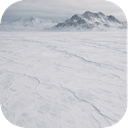
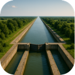

## Terrain

The continent of Zubrenn is a patchwork of eleven terrain types. Each has its
own character — what it can provide a colony, how hard it is to cross, and
whether colonists can live and build there.

#### Sea

The Sea blankets the lowlands between the continents, a cold cobalt expanse stirred by the pull of Zubrenn's twin stars. It gives up a little food from the shoals and plankton near its surface but no building material, and it cannot be settled directly. Shallow stretches become highways once a colony raises a Dock, and road or monorail bridges can leap a narrow strait to stitch neighboring lands together.

#### Grassland

Rolling Grassland is the gentle heart of the continent, carpeted in soft blue-green turf that ripples under the wind. It is the easiest ground on which to feed a young colony — generous with food and offering a little raw material besides — and it is quick and cheap to cross. Flat, fertile, and welcoming, grassland is where most colonies first take root and spread their earliest farms.

#### Hills

The Hills rise in long, grass-stubbled ridges where the land begins to buckle toward the mountains. They trade a little fertility for mineral wealth, giving modest food but a good flow of material as ores press close to the surface. The uneven ground slows foot travel and makes roadbuilding a touch more laborious, but the ridges reward colonies willing to dig for what lies beneath.

#### Forest

Dense Forest cloaks the temperate belts in towering, slow-growing canopy. The shaded understory offers only modest food but a steady supply of material in timber and fiber, making forests a dependable source of building stock. The thick growth hampers movement and makes clearing a path time-consuming, so transport lines through the woods are built slowly and deliberately.

#### Jungle

The Jungle chokes the equatorial lowlands in riotous, humid overgrowth where strange alien flora climbs over itself in competition for light. It yields a little food and a fair harvest of material, but it is the hardest land to traverse, swallowing roads and swallowing time as crews hack through the tangle. Beneath the dripping canopy, however, lie some of the planet's most prized biological curiosities.

#### Desert

The Desert stretches in sun-cracked flats and dune seas where the twin stars scorch the ground and little water remains. On its own it is barren, giving neither food nor material, yet its open, firm terrain is quick to cross and cheap to road. What the desert withholds in sustenance it can repay in exotic deposits that only form in bone-dry conditions.

#### Mountain (Low)

The lower Mountains climb in pine-shadowed slopes and stony benches where the air thins and the stone turns rich. They grow no food but yield a strong flow of material as veins of ore break through the crust. Steep and demanding, they slow every traveler and make transport costly to build, and no sea or river route may pass through them — but their mineral bounty makes the effort worthwhile.

#### Mountain (High)

The high peaks of Mountains tower above the snow line in jagged, wind-scoured ridges. They are the richest source of raw material on the planet, but they grow no food and cannot be settled or built upon. Treacherous and slow to cross, these summits are prized only for what can be hauled down from them to the colonies below.

#### Frozen

The Frozen wastes seal the poles and the loftiest heights beneath blinding sheets of ice. They offer neither food nor material, and their highest, iciest reaches are wholly impassable. Yet surprising life clings to the margins of the thaw, and colonies that endure the cold may find the ice itself harbors unexpected harvests when the brief seasons turn.

#### Plains

The Plains are the pale, upland cousins of the grasslands, forming where higher, drier ground gives way to open sage-colored steppe. Balanced and easily crossed, they provide a steady measure of both food and material across broad, level ground ideal for expansion. Their wide horizons make them natural corridors for roads, monorails, and the herds that roam them.

#### Wetlands

The Wetlands form where sea and river meet the land, a glistening maze of marsh, reed, and standing water. They grow little food but offer some material, and uniquely they lift colonist spirits thanks to their serene, teeming beauty. Soggy and slow to road, the marshes nonetheless brim with life and reward colonies that learn to work the water's edge.

#### River

Rivers carve a natural transportation network across the continent, offering fast routes for both goods and colonists. They also supply abundant water, essential for sustaining population growth and agricultural productivity. While unbridged rivers pose a modest barrier to foot and vehicle traffic, constructing bridges easily removes this obstacle, integrating river tiles into the broader transport grid.

#### Canals

Canals allow colonies to extend the advantages of rivers into inland regions. By excavating waterways that link landlocked tiles to existing river networks, they provide reliable navigation routes for transport vessels and a steady source of irrigation water for agriculture. Though construction demands labor and engineering, canals dramatically boost connectivity and resource availability across the continent.